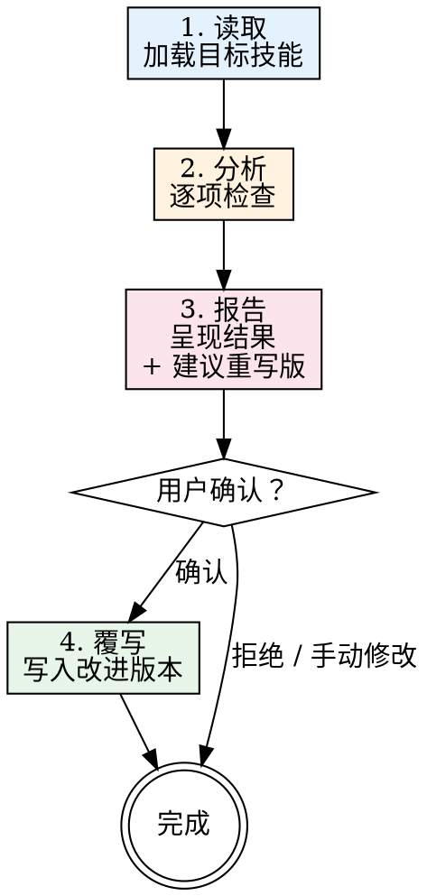

# 审查技能

审查指定的技能文件，诊断质量问题，给出具体修复建议，确认后覆写改进版本。

## 何时使用

- 用户要求检查/审查/审计某个技能
- 用户想改进或优化已有技能
- 用户问"这个技能写得好不好？"或"这个技能有什么问题？"
- 发布或分享技能之前

**不适用场景：**
- 从零创建全新技能
- 纯粹研究技能的工作原理

## 流程



### 步骤 1：读取 — 加载目标技能

读取 SKILL.md 及所有辅助文件（`references/`、`scripts/`、`data/`）。

识别技能类型：

| 类型 | 识别信号 |
|------|---------|
| **纪律执行型** | 有铁律、合理化借口表、红旗清单 |
| **技术型** | 有 before/after 代码对比、分层结构 |
| **参考型** | 主要是表格和查阅数据 |
| **路由型** | 有子技能路由表、决策流程图 |
| **搜索驱动型** | 有 scripts/、data/ 目录含 CSV、搜索命令 |
| **混合/自定义型** | 不完全属于以上任何类型，有自定义工作流程 |

### 步骤 2：分析 — 逐项检查

读取 `references/checklist.md` 获取完整检查清单，对每一项评分为 PASS / WARN / FAIL。

检查清单包含五大类：

| 类别 | 编号 | 关注点 |
|------|------|--------|
| A. Frontmatter | F1-F5 | name/description 格式、CSO 优化 |
| B. 结构与内容 | S1-S6 | 标准章节是否齐全 |
| C. Token 效率 | T1-T5 | 字数、拆分、去重 |
| D. 类型专项 | D/K/R/X | 按识别的类型选择对应检查 |
| E. 质量与清晰度 | Q1-Q6 | 流程图用法、格式、可操作性、写作风格 |

### 步骤 3：报告 — 呈现结果

按以下格式输出报告：

```
## 审查结果：[技能名]

**类型：** [检测到的类型]
**字数：** [N] 词
**总览：** [X 项通过 / Y 项警告 / Z 项不合格]

### FAIL（必须修复）
- [编号] 问题描述 → 修复建议
  ...

### WARN（建议修复）
- [编号] 问题描述 → 修复建议
  ...

### PASS
- [编号] [编号] ...

### 建议重写版
[展示完整的重写后 SKILL.md]
```

**重写规则：**
- 修复所有 FAIL 项
- 修复明确无争议的 WARN 项
- 保留作者的意图、风格和领域内容
- 不添加作者未计划的内容，不改变技能类型
- 对非显而易见的修改添加行内注释 `<!-- REVIEW: 修改原因 -->`

### 步骤 4：覆写 — 确认后执行

使用 `AskUserQuestion` 确认后再覆写：

> 审查已完成。建议重写版修复了 [N] 个问题。
> 是否用改进版本覆写原文件？

**用户确认后：**
1. 用重写版本覆写 SKILL.md
2. 移除所有 `<!-- REVIEW: ... -->` 注释
3. 展示变更摘要

**用户拒绝后：**
- 不做任何操作。用户可自行挑选修改。

## 审查时的常见错误

| 错误 | 正确做法 |
|------|---------|
| 改写作者的语气/风格而非修复问题 | 只修复结构和质量问题 |
| 添加作者未计划的功能 | 保留原始范围 |
| 忽略类型专项检查 | 务必先识别技能类型 |
| 建议精简字数但不给出具体删减方案 | 提供实际精简后的文本 |
| 未经确认就覆写 | 必须先征求确认 |