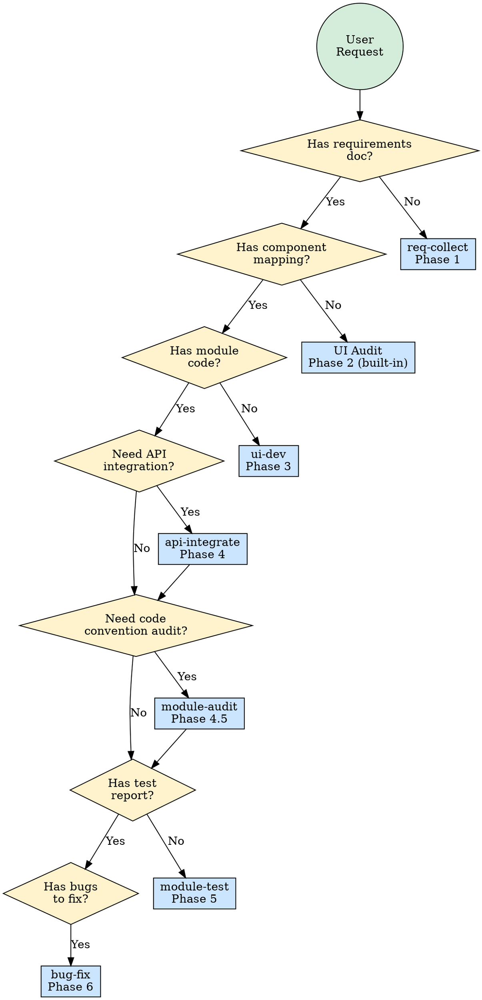

# 前端开发编排器

统一的前端开发技能：根据当前开发阶段自动路由到对应的子技能。

## 适用场景

- 从需求到交付，启动一个新的前端模块开发
- 处于前端开发的任何特定阶段
- 分析 UI 设计稿并映射到组件
- 需要了解下一步应进入哪个开发阶段

## 子技能路由

| 任务 | 子技能 | 说明 |
|------|--------|------|
| 收集/整理需求 | `req-collect` | 从禅道/飞书抓取，生成结构化需求文档 |
| 分析 UI 设计稿 | 内置（Phase 2） | 读取设计稿，映射到组件，输出映射文档 |
| 开发页面/模块 | `ui-dev` | 创建模块骨架，实现 hooks、layouts、组件 |
| 联调接口 | `api-integrate` | 根据接口文档生成 service/type/mock |
| 规范审计与修复 | `module-audit` | 对联调完成模块做结构/代码约定检查并自动修复 |
| 测试模块 | `module-test` | 基于验收标准进行系统性测试 |
| 修复缺陷 | `bug-fix` | 根因分析、最小化修复、验证 |



## 内置功能：UI 设计稿审计（Phase 2）

此阶段直接在路由技能内部处理，因为它相对轻量。

### 前置条件

- `.ai/requirements/{module}.req.md` 必须已存在（由 Phase 1 产出）
- UI 设计稿图片已放入 `.ai/designs/{module}/mockups/`

### 第 1 步：读取设计稿

读取 `.ai/designs/{module}/mockups/` 目录下的所有图片文件。对每个页面/屏幕：
- 识别所有可见的 UI 元素（表格、表单、按钮、弹窗、筛选器、标签页等）
- 记录布局结构（侧边栏 + 主区域、头部 + 内容、分栏布局等）
- 识别数据展示模式（列表、详情、树形、图表等）

### 第 2 步：搜索项目组件

在项目中搜索可用组件：

1. **项目组件**：通过 Glob `{srcRoot}/components/**/*.tsx` 搜索并读取其导出
2. **UI 库组件**：读取 `node_modules/{uiLibPackage}/package.json` 或类型声明文件，查找可用组件
3. **通用模式**：检查 `{srcRoot}/modules/` 中已有模块的可复用模式

### 第 3 步：生成组件映射

写入 `.ai/designs/{module}/component-mapping.md`：

```markdown
# Component Mapping: {module}

## Screen: {screen-name}

| Design Element | Component | Source | Props (key ones) | New Component? |
|---------------|-----------|--------|-------------------|----------------|
| Data table | Table | @m9/ui | columns, dataSource, pagination | No |
| Search form | SearchForm | src/components | fields, onSearch | No |
| Detail modal | Modal + Form | @m9/ui | visible, onOk, formItems | No |
| Status tag | CustomStatusTag | — | status, text | YES — needs creation |

## New Components Needed
- [ ] CustomStatusTag: renders colored tag based on status enum

## Layout Structure
- Page uses `ListDetail` layout pattern
- Left: filterable list, Right: detail panel
```

### 第 4 步：与需求交叉验证

验证需求文档中的每条 REQ 都有对应的 UI 元素映射。标记所有没有明确 UI 表达的需求。

## 工作流

### 工作流 1 - 完整模块开发（Phase 1→6）

1. `/req-collect {module}` - 收集并结构化需求
2. `/fe-dev audit {module}` - 审计 UI 设计稿，产出组件映射
3. `/ui-dev {module}` - 创建骨架并实现模块
4. `/api-integrate {module}` - 对接真实 API 端点
5. `/module-audit {module}` - 规范审计并自动修复可确定问题
6. `/module-test {module}` - 系统性测试
7. `/bug-fix {module}` - 修复发现的缺陷

### 工作流 2 - 快速页面开发（仅 Phase 3）

当需求和设计已经明确时：
1. `/ui-dev {module}` - 直接创建骨架并实现

### 工作流 3 - 仅接口联调（仅 Phase 4）

当模块 UI 已存在但需要对接真实 API 时：
1. `/api-integrate {module}` - 根据接口文档生成 service 层

## 阶段文档流转

```
Phase 1 ──writes──→ .ai/requirements/{module}.req.md
                     .ai/requirements/{module}.issues.md
         ↓
Phase 2 ──reads req──→ writes .ai/designs/{module}/component-mapping.md
         ↓
Phase 3 ──reads req+mapping──→ writes src/modules/{module}/ code
         ↓
Phase 4 ──reads api docs──→ updates defs/service.ts, defs/type.ts, __test__/mock.ts
         ↓
Phase 4.5 ──reads template+examples──→ fixes src/modules/{module}/ code conventions
         ↓
Phase 5 ──reads req+code──→ writes .ai/test-reports/{module}.report.md
         ↓
Phase 6 ──reads report──→ fixes code + updates report
```

## 参考文档

| 主题 | 文件 |
|------|------|
| 路由决策规则 | `references/routing-rules.md` |
| 模块模板架构 | `references/module-template-spec.md` |
| .ai/ 文档约定 | `references/doc-convention.md` |

## 集成关系

- **req-collect**：产出需求文档，供后续所有阶段消费
- **ui-dev**：核心开发阶段，严格遵循模块模板规范
- **api-integrate**：为 ui-dev 补充真实 API 连接
- **module-audit**：在联调与测试之间做规范复核，自动修复确定性问题
- **module-test**：基于 Phase 1 的需求进行验证
- **bug-fix**：消费 Phase 5 产出的测试报告
