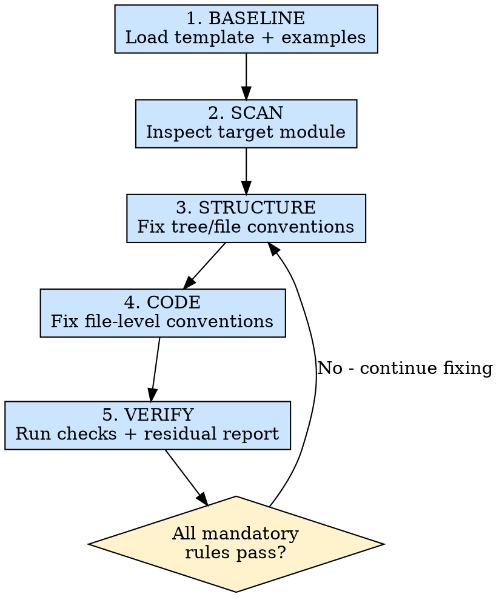

# 模块规范审计

## 概述

对已完成的业务模块进行“结构 + 代码风格 + 模板约定”三层审计，并直接修复可确定的问题。

**核心原则：** 不只指出问题，必须给出并落地可执行修复。

**违背规则的字面意思，就是违背规则的精神。**

## 适用场景

**必须使用：**
- 接口联调完成后，准备提测前
- 代码评审前，希望先做模板规范对齐
- 从旧模块拷贝改造后，需要快速排查结构和命名漂移
- 他人交付模块后，需要统一代码规范

**例外情况（需征询开发者）：**
- 模块处于 PoC 阶段且不会进入主分支
- 模块明确声明不使用当前模板体系（需先确认替代规范）

## 铁律

```text
IF IT CAN BE DETERMINISTICALLY FIXED, FIX IT NOW - DO NOT LEAVE ACTIONABLE VIOLATIONS UNCHANGED
```

看到可确定修复的问题（文件缺失、命名错误、导出不一致、模板占位符残留）时，不允许只提建议不改代码。

## 执行流程



### 第 1 步：BASELINE - 加载基线

优先读取以下基线（相对当前 skill 目录）：
- `baselines/module-template/`（模板真值）
- `baselines/module-examples/`（真实落地写法）

### 第 2 步：SCAN - 扫描问题

按 `references/module-checklist.md` 执行检查，输出问题清单：
- 目录/文件缺失或命名错误
- 模板关键模式缺失
- 占位示例代码残留
- hooks 与 layouts 之间的数据契约不一致
- 类型定义和实现脱节

### 第 3 步：STRUCTURE - 修复结构问题

对结构类问题直接修复：
- 创建缺失目录/文件
- 统一布局样式文件命名为 `style.module.less`（并同步更新 import）
- 补齐 `layouts/index.ts`、`hooks/index.ts`、`__test__/mock.ts`
- 保持 `defs/`、`hooks/`、`layouts/` 的模板结构
- `utils.ts`、`components/` 如无相关代码，可省略。

### 第 4 步：CODE - 修复代码约定问题

按 `references/auto-fix-playbook.md` 的模板执行修复：
- 入口 `index.tsx` 统一为 `createModule` 模式
- `defs/type.ts` 补齐 `DataParams/CtrlParams/WatcherParams/LayoutProps` 链路
- `hooks/index.ts` 保持 `useData -> useController -> useWatcher` 调用顺序
- `layout` 保持 `data` 与 `controllers` 输入契约
- 去除模板占位符和示例残留（如 `__MODULE_NAME__`、`exampleFn`、`queryExample`）

对无法确定业务语义的问题：
- 保留现有逻辑
- 在结果中明确标记“需人工确认”

### 第 5 步：VERIFY - 校验与收尾

至少执行以下验证：
- 文件结构完整性检查
- 占位符与示例残留扫描
- import 路径与导出一致性检查
- 若项目可运行：执行 lint/type-check/单测中的最小必要命令

最后输出：
- 已修复项（文件 + 修改点）
- 未修复项（原因 + 建议）

## 速查表

| 阶段 | 关键动作 | 完成标准 |
|------|---------|---------|
| BASELINE | 读取模板与案例 | 明确本次审计基线 |
| SCAN | 生成违规清单 | 每条规则有结论 |
| STRUCTURE | 修复目录与文件问题 | 结构符合模板 |
| CODE | 修复关键代码约定 | 关键文件模式一致 |
| VERIFY | 运行校验并汇总 | 无阻断级违规 |

## 常见借口

| 借口 | 现实 |
|------|------|
| “结构差一点不影响功能” | 会直接拉低后续维护与评审效率 |
| “先提测，规范以后再补” | 以后通常不会补，而且改动成本更高 |
| “这个模块是特例” | 特例必须有明确设计说明，不是默认状态 |
| “先标 TODO” | 可确定修复的问题不允许留 TODO |

## 危险信号 - 立即停下来

- 发现模板占位符残留但选择忽略
- hooks 与 layout 的参数契约已不一致仍继续堆逻辑
- 改动引发类型错误后未回归检查
- 只输出问题列表，不做任何自动修复

## 参考文档

| 主题 | 文件 |
|------|------|
| 详细检查清单 | `references/module-checklist.md` |
| 自动修复手册 | `references/auto-fix-playbook.md` |
| 内置基线说明 | `baselines/README.md` |

## 集成关系

- **上游：** `ui-dev`（模块开发完成）、`api-integrate`（接口联调完成）
- **下游：** `module-test`（测试验证）
- **建议位置：** 在 Phase 4 和 Phase 5 之间作为代码质量闸门
