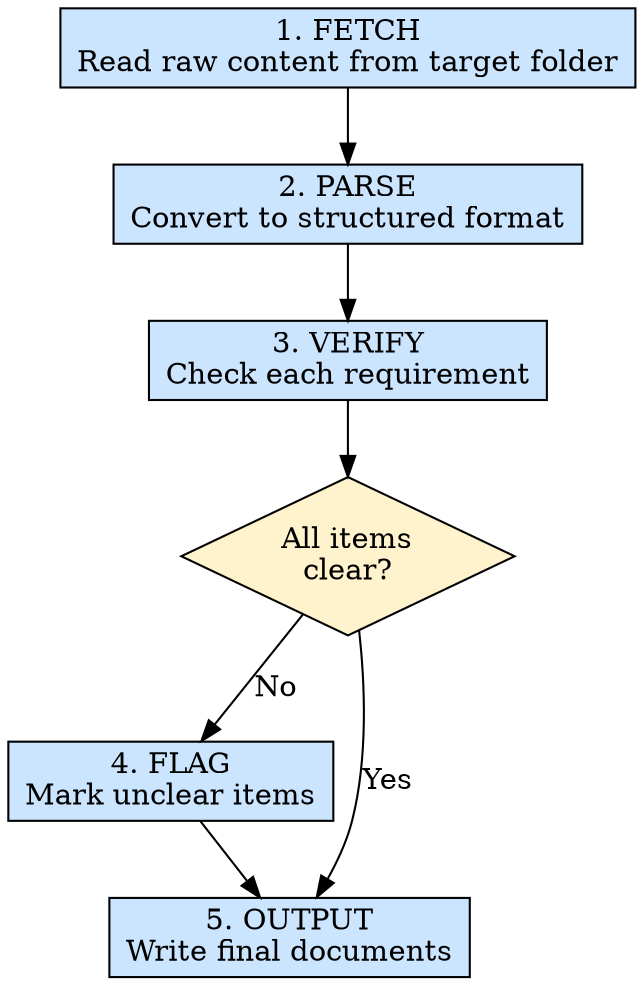

# 需求收集

## 概述

从指定文件夹内的需求文件（可含用户补充输入）收集、结构化并验证需求，转换为下游阶段可直接消费的标准格式。

**核心原则：** 需求必须明确、可测试、无歧义 — 绝不假设产品意图。

**违反规则的字面意思就是违反规则的精神。**

## 适用场景

**必须使用：**
- 启动一个新功能模块
- 从产品/PM 处接到新需求
- 开发过程中需求发生变更或更新
- 需要整合来自可能多个来源的需求

**例外情况（需征询开发者）：**
- 一次性原型，需求仅通过口头传达
- 紧急修复（Hotfix），且开发者已给出明确指示

觉得"这个需求我已经理解了"？停下来。照样把它结构化。

## 铁律

```
EVERY UNCLEAR REQUIREMENT MUST BE FLAGGED — NEVER ASSUME PRODUCT INTENT
```

发现了一条模糊的需求？把它标记到 `.ai/missions/{module}/reqDocs/issues.md` 中。不要猜测他们的意思。不要用"常识"来填补空白。

**没有例外：**
- 不要假设"显而易见"的验收标准 — 让产品来定义
- 不要自行解读模糊描述 — 标记出来等待澄清
- 不要跳过"看起来很简单"的需求 — 它们同样需要结构化
- "应该"、"可能"、"理想情况下"、"大概"这类词是危险信号 — 标记它们

## 违反后果

若跳过澄清直接进入开发，后续阶段（`ui-dev`、`api-integrate`、`module-test`、`bug-fix`）必须中止并回退到本技能；先补齐 `.ai/missions/{module}/reqDocs/req.md` 和 `issues.md` 后再继续。

## 执行流程



### 第 1 步：抓取

获取原始内容：

**从配置中读取（推荐）：**
- 检查 `.ai/missions/{module}/config.json` 中的 `reqDocSources` 字段，获取需求文档的源文件夹或文件路径
- 扫描并读取配置的路径中的需求文件

**从用户指定文件夹获取：**
- 从用户特定指定的文件夹内扫描并读取需求文件
- 按用户指定的文件名或模式过滤目标文件（如有）

**从用户输入获取：**
- 接受粘贴的文本、截图或文档内容
- 解析所提供的任何格式

**验证点：** 原始内容已完整捕获，抓取过程中无数据丢失。

**强制验证命令（至少执行）：**
- `test -d "{source-folder}"` — 确认需求源目录存在
- `find "{source-folder}" -type f | sort` — 列出所有候选文件，确认未漏扫
- `find "{source-folder}" -type f -size 0` — 检查空文件并单独标记

### 第 2 步：解析

将原始内容转换为结构化需求格式（参见 `references/requirement-format.md`）。

针对每条需求：
- 分配顺序编号：REQ-001、REQ-002……
- 提取：标题、描述、优先级（如有说明）、UI 参考、API 依赖
- 制定验收标准：每条必须可测试（AC-001、AC-002……）
- 标记初始状态：CLEAR 或 NEEDS_CLARIFICATION

### 第 3 步：验证

逐条审查结构化后的需求：

| 检查项 | 关注点 |
|-------|-------|
| 完整性 | 是否包含验收标准？ |
| 具体性 | 描述是否足够具体，可以直接实现？ |
| 可测试性 | 每条验收标准能否用"是/否"来验证？ |
| 歧义性 | 是否包含"应该"、"可能"、"理想情况下"、"大概"、"etc."、"等"？ |
| 范围 | 是否为单一职责，而非多个功能的捆绑？ |
| UI 清晰度 | 是否明确了影响哪个页面/组件？ |

### 第 4 步：标记

对任何标记为 NEEDS_CLARIFICATION 的需求：
- 撰写具体的问题（不是泛泛的"你什么意思？"）
- 在适用时提供可能的解读方案
- 在 `.ai/missions/{module}/reqDocs/issues.md` 中按需求分组列出问题

### 第 5 步：输出

将两个文件写入 `.ai/missions/{module}/reqDocs/`：

1. **`req.md`** — 所有结构化需求（格式参见 references）
2. **`issues.md`** — 所有标记的待澄清问题（仅在存在不清晰项时生成）

## 速查表

| 阶段 | 关键活动 | 成功标准 |
|------|---------|---------|
| 抓取 | 获取原始内容 | 所有来源内容已完整捕获 |
| 解析 | 结构化每条需求 | 每条都有编号、描述和验收标准 |
| 验证 | 检查清晰度和完整性 | 每条已标记为 CLEAR 或 NEEDS_CLARIFICATION |
| 标记 | 撰写具体问题 | 每条不清晰的需求都有可执行的问题 |
| 输出 | 写入 .ai/missions/{module}/reqDocs/ 文档 | `req.md` 已生成，包含所有需求 |

## 常见借口

| 借口 | 现实 |
|------|------|
| "这个需求很明显" | 如果真的明显，结构化它只需 30 秒 |
| "写代码时再澄清" | 不清晰的需求会导致返工 — 先澄清再动手 |
| "设计稿已经说明了" | 设计稿展示的是 UI，不是业务逻辑和边界情况 |
| "PM 会告诉我哪里不对" | PM 假设你已经理解了 — 显式优于隐式 |
| "先做主流程，边界条件后面补" | 边界条件通常决定是否可上线 — 需求阶段就要收齐 |

## 危险信号 — 立即停下来

- 你在凭想象编写 PM 从未描述过的用户场景作为验收标准
- 你没有认真检查就把所有需求标记为 CLEAR
- 你因为"这看起来是第 2 阶段的事"而跳过某些需求
- 你在没有产品输入的情况下自行编造优先级
- 你把多个独立功能合并成了一条 REQ

## 参考文档

| 主题 | 文件 |
|------|------|
| 结构化需求格式 | `references/requirement-format.md` |

## 集成关系

- **输出被以下阶段消费：** `ui-dev`、`api-integrate`、`module-test`、`bug-fix`
