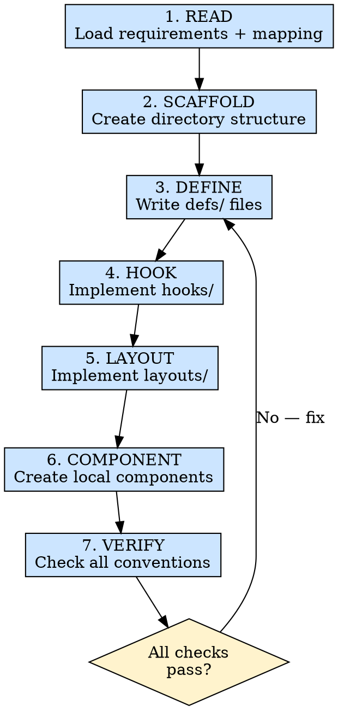

# UI 开发

## 概述

按照严格的模块模板架构，创建并实现前端模块。

**核心原则：** 每个模块遵循相同的结构 —— 一致性是可维护性和团队效率的基石。

**违背规则的字面意义，就是违背规则的精神。**

## 适用场景

**必须使用：**
- 创建新的前端模块/页面
- 根据需求和/或设计稿实现 UI
- 构建模块级组件

**例外情况（需征询开发者）：**
- 用完即弃的快速原型
- 修改早于模板规范的已有模块（先确认是否需要迁移）

在想"这个模块太简单了，不需要完整模板"？打住。这是自我合理化。简单模块按规范搭建反而更快。

## 铁律

```
EVERY MODULE MUST FOLLOW THE TEMPLATE ARCHITECTURE — NO SHORTCUTS, NO CUSTOM STRUCTURES
```

如果创建的模块没有遵循正确的目录结构，删掉它，按规范重新搭建。

**没有例外：**
- 不要因为"没有副作用"就跳过 `hooks/useWatcher.ts` —— 创建一个空文件
- 不要因为"只是一个处理函数"就把逻辑放进 `layouts/` —— 它属于 `useController`
- 不要因为"更简单"就使用 `useState` —— 使用 ahooks 的 `useSetState`
- 不要因为"之后再补"就跳过类型定义 —— 先定义类型

## 执行流程



### 第 1 步：读取上下文

加载上下文文档：
- `.ai/requirements/{module}.req.md` —— 结构化需求文档（必需）
- `.ai/designs/{module}/component-mapping.md` —— 组件映射（如果存在）

理解以下内容：
- 模块需要展示哪些数据
- 需要哪些用户交互
- 应使用哪些组件（来自映射或搜索结果）

### 第 2 步：搭建骨架

按照 `references/module-template-spec.md` 创建完整的目录结构：

```
src/modules/{ModuleName}/
├── index.tsx
├── defs/
│   ├── constant.ts
│   ├── type.ts
│   └── service.ts
├── hooks/
│   ├── useData.ts
│   ├── useController.ts
│   ├── useWatcher.ts
│   └── index.ts
├── layouts/
│   └── Default/
│       ├── index.tsx
│       └── index.module.less
└── __test__/
    ├── index.tsx
    └── mock.ts
```

所有文件和目录全部创建，不许遗漏。

**验证：** 运行 `ls -R src/modules/{ModuleName}/` 确认每个文件都存在。

### 第 3 步：编写定义文件 (defs/)

按以下顺序编写定义文件：

1. **`constant.ts`**：MODULE_NAME、LayoutEnum、列定义、静态配置
2. **`type.ts`**：完整类型链（API 响应 → 数据 → 控制器 → Props）
3. **`service.ts`**：API 函数桩（真正的实现在 Phase 4 完成）

参见 `references/module-creation-steps.md` 获取模板。

**验证：** TypeScript 类型能编译通过。所有类型形成完整链条。

### 第 4 步：实现 Hooks (hooks/)

按依赖顺序实现 Hooks：

1. **`useData.ts`**：状态 + API 数据请求（useSetState、useRequest、useCreation）
2. **`useController.ts`**：事件处理函数（useMemoizedFn），从 useData 接收数据
3. **`useWatcher.ts`**：副作用（useEffect、useMount）
4. **`index.ts`**：聚合器 —— 组合所有 Hook，导出 `_`（数据）和 `$`（控制器）

参见 `references/hook-patterns.md` 获取标准模式。

**验证：**
- 不使用 `useState`、`useCallback`、`useMemo` —— 只用 ahooks 的等价物
- useController 通过参数从 useData 获取数据（而非直接导入状态）
- index.ts 正确分离 `_` 和 `$`

### 第 5 步：实现布局 (layouts/)

实现 Default 布局：

1. **`Default/index.tsx`**：纯展示组件
   - 通过 props 接收 `_` 和 `$`
   - 使用组件映射或搜索结果中的组件
   - 无 Hook、无状态、无业务逻辑
2. **`Default/index.module.less`**：作用域样式

参见 `references/layout-patterns.md` 获取模式。

**验证：**
- 布局中没有任何 Hook、没有 useState、没有 useEffect
- 所有数据来自 `_`，所有处理函数来自 `$`
- 使用 `classNames` + CSS Modules

### 第 6 步：创建组件（如需要）

在 `components/` 中创建模块级组件：
- 仅当组件映射中标识了尚不存在的组件时才创建
- 每个组件独立目录，包含 `index.tsx` + `index.module.less`
- 遵循与布局相同的纯展示原则

### 第 7 步：验证

运行 `references/module-template-spec.md` 中的完整验证清单：

- [ ] 目录结构与模板完全一致
- [ ] `index.tsx` 仅负责将 Hook 连接到布局
- [ ] 所有 Hook 使用 ahooks（useSetState、useRequest、useCreation、useMemoizedFn、useMount）
- [ ] 类型链完整且相互关联
- [ ] 布局为纯展示组件
- [ ] CSS 使用 Modules 配合 classNames
- [ ] 遵循 `_` / `$` 约定
- [ ] 无禁止的模式（useState、useCallback、useMemo）

## 速查表

| 阶段 | 关键活动 | 成功标准 |
|------|---------|---------|
| 读取上下文 | 加载需求文档 + 组件映射 | 上下文已理解 |
| 搭建骨架 | 创建所有目录/文件 | 结构与模板一致 |
| 编写定义 | 编写常量、类型、服务桩 | 类型能编译，链条已连接 |
| 实现 Hooks | 按 useData → useController → useWatcher → index 顺序实现 | 仅用 ahooks，正确分层 |
| 实现布局 | 纯展示组件 | 布局中无 Hook/状态 |
| 创建组件 | 创建所需的本地组件 | 遵循组件模式 |
| 验证 | 检查所有约定 | 清单所有项目通过 |

## 常见借口

| 借口 | 现实 |
|------|------|
| "这个页面太简单了，不需要 Hook" | 再简单的页面也能从一致的结构中受益 |
| "之后再重构成模板结构" | 你不会的。从一开始就做对 |
| "一个字段用 useSetState 太重了" | 一致性 > 微优化 |
| "布局里只加一个小处理函数" | 放到 useController 里。布局只负责展示 |
| "我不需要 useWatcher" | 创建一个空文件。未来的你会感谢现在的你 |

## 危险信号 — 立即停下来重做

- 你正在布局组件中使用 `useEffect` 或 `useState`
- 你正在布局中直接导入 service 函数
- 你正在跳过类型链而使用 `any`
- 你创建了一个扁平模块，没有 hooks/ 和 defs/ 目录
- 你正在 `index.tsx` 中编写业务逻辑

## 参考文档

| 主题 | 文件 |
|------|------|
| 模块创建步骤 | `references/module-creation-steps.md` |
| Hook 模式 | `references/hook-patterns.md` |
| 布局模式 | `references/layout-patterns.md` |
| 模块模板规范 | `references/module-template-spec.md` |

## 集成关系

- **依赖于：** `req-collect`（Phase 1 输出）
- **输出供以下阶段使用：** `api-integrate`（Phase 4）、`module-test`（Phase 5）
