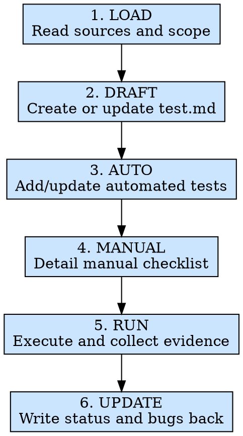

# 模块测试

## 概述

根据 `.ai/missions/{module}/reqDocs/req.md` 或开发者明确提出的测试点，先生成或更新 `.ai/missions/{module}/testDocs/test.md`，再补齐自动化测试、执行验证并把结果回写到同一份文档。交付物不是一句“已经测过了”，而是一份可追溯、可复测、可回归的测试资产。

**核心原则：** 先把测试点写进文档，再声称“已覆盖”。没有落到 `test.md` 的测试点，默认等于没有被管理。

**违反规则的字面意思就是违反规则的精神。**

## 适用场景

**必须使用：**
- 模块开发完成，准备进入发布前验证
- 接口联调完成后，需要做完整模块测试
- 开发者额外给出一批测试点，需要整理成测试文档并执行
- 缺陷修复后需要做回归验证
- 在宣布模块“完成”之前，需要沉淀一轮可复用的测试资产

**例外情况（需征询开发者）：**
- 只做一次临时 smoke check，且不会作为正式交付依据
- 当前既没有需求文档，也没有开发者给出的测试点，测试范围无法确定

觉得“我先测一遍，文档回头再补”？停下来。回头补的测试文档，通常既不完整，也不可信。

## 铁律

```text
EVERY ACCEPTANCE CRITERION OR EXPLICIT TEST POINT MUST BECOME A TEST CASE ENTRY
```

你可以决定它是 `TC-*` 还是 `MC-*`，但不能决定“不记录”。

**没有例外：**
- UI、视觉、响应式、浏览器兼容项也必须落成 `MC-*`
- 代码可观测逻辑优先补自动化测试，而不是只写一句“已验证”
- 没有实际执行结果，不准把状态改成 `PASS`
- 失败项必须关联 Bug 记录，不能只写“有问题”
- 回归时必须先读取已有 `test.md`，不能把上一轮结果直接覆盖掉

## 违反后果

如果 `.ai/missions/{module}/testDocs/test.md` 不存在、未覆盖本轮范围，或条目仍然停留在模糊描述层，模块测试视为未完成；带 `FAIL` 项时必须回写 `bugDoc/bug.md` 后再进入 `bug-fix`。

## 执行流程



### 第 1 步：LOAD - 读取上下文与范围

优先读取以下信息：
- `.ai/missions/{module}/reqDocs/req.md` - 主需求来源
- 开发者补充的测试点文档或消息 - 本轮新增测试范围
- `.ai/missions/{module}/testDocs/test.md` - 已有测试文档，供回归或增量更新时复用
- `.ai/missions/{module}/apiDoc/api.md` - 接口契约、错误码、边界输入
- `.ai/missions/{module}/bugDoc/bug.md` - 历史失败项与回归范围
- `src/modules/{ModuleName}/` - 实际实现和 `__test__/` 现状

必须先确认：
- 本轮是“全量模块测试”还是“指定测试点/回归范围”
- 哪些条目可自动化为 `TC-*`，哪些只能手动为 `MC-*`
- 当前 `test.md` 是首次生成，还是在上一轮基础上增量更新

如果没有 `req.md`，也没有开发者给出的测试点，不要继续脑补测试范围；直接回到开发者处补上下文。

**至少执行：**
- `test -d ".ai/missions/{module}"`
- `find ".ai/missions/{module}" -maxdepth 3 -type f | sort`
- `find "src/modules/{ModuleName}" -maxdepth 3 -type f | sort`

### 第 2 步：DRAFT - 梳理测试文档

以 `../../references/test-doc-template.md` 为模板基线，生成或更新 `.ai/missions/{module}/testDocs/test.md`。

梳理规则：
- 有 `reqDocs/req.md` 时：每条 AC 至少对应 1 个 `TC-*` 或 `MC-*`
- 有开发者补充测试点时：按原意拆成独立条目，不把多个动作塞进一个 case
- 同一 AC 同时有主流程、异常流程和边界场景时，拆成多个 case
- `TC-*` 用于自动化验证；`MC-*` 用于手动、视觉、环境相关验证
- 初次生成时，条目 `状态` 统一为 `PENDING`
- 回归时优先复用已有 case ID；只有新增场景才分配新的 `TC-*` 或 `MC-*`

填写约定：
- `模块名`：与实际模块目录保持一致
- `测试范围`：写清来源，例如 `reqDocs/req.md + USER_INPUT + bugDoc/bug.md`
- `关联需求` / `关联 AC`：有真实编号就写真实编号；只有用户测试点时填写 `USER_INPUT`
- `关联接口`：有明确接口时写 `API-*` 或接口标识；没有则写 `无`
- `场景`：一句话说明被验证的行为，不写空话
- `前置条件`：明确账号、数据、页面位置、mock 或环境条件
- `期望结果`：必须能直接判断 `PASS` / `FAIL`
- `实际结果`：执行前可写 `待执行`，执行后必须回填证据
- `总状态`：由条目状态汇总得出，不允许拍脑袋填写

示例：

```markdown
# 测试文档（test.md）

- 模块名：fund-list
- 测试范围：reqDocs/req.md + USER_INPUT
- 总状态：PENDING
- 风险摘要：待执行回归；删除接口需要联调环境支持

## TC-001

- 关联需求：REQ-001
- 关联 AC：AC-001
- 关联接口：API-001
- 类型：自动
- 场景：空列表时显示空状态占位
- 前置条件：mock 返回 data.list = []
- 期望结果：页面显示空状态文案且不渲染表格行
- 实际结果：待执行
- 状态：PENDING
- 已转 Bug：

### 执行步骤

1. 准备空列表 mock 数据
2. 渲染模块
3. 断言空状态文案可见，表格数据行为 0
```

### 第 3 步：AUTO - 补齐自动化测试

把可通过代码稳定验证的 `TC-*` 落到模块的 `__test__/` 目录：
- `src/modules/{ModuleName}/__test__/index.tsx`
- 如测试体量较大，可按主题拆分子文件
- 依赖接口数据时，保持与 `__test__/mock.ts` 的契约一致

规则：
- 沿用项目现有测试栈，不要为了当前 skill 引入另一套框架
- 测试标题或注释必须能追溯到 `TC-ID` / `REQ/AC`
- 优先覆盖 `useData`、`useController`、`utils`、数据映射、错误处理等稳定逻辑
- 不要为视觉细节硬写脆弱快照；这类场景放 `MC-*`
- 若新增了自动化 case，同步把对应条目写回 `test.md`

示例：

```typescript
describe('{ModuleName}', () => {
  it('TC-001 REQ-001 AC-001 shows empty state when list is empty', async () => {
    // Arrange
    // Act
    // Assert
  });
});
```

### 第 4 步：MANUAL - 补齐手动检查项

为无法稳定自动化的场景完善 `MC-*` 条目：
- 布局、样式、滚动、吸顶、截断、视觉层级
- 响应式和不同浏览器渲染
- 表单可用性、提示反馈、交互节奏
- 权限、真实接口返回、第三方依赖、外部环境联动
- 键盘操作、焦点流转、无障碍基础行为（如需求涉及）

要求：
- 步骤必须可执行，禁止“验证页面正常”这类空话
- 期望结果必须可直接判定
- 同一条 `MC` 只验证一个明确结论；不要混入多个无关判断
- 若手动验证依赖特定浏览器、账号或数据，必须写入前置条件

### 第 5 步：RUN - 执行并记录结果

执行顺序：
1. 先运行自动化测试
2. 再按 `MC-*` 执行手动测试
3. 最后补边界、异常和回归场景

记录规则：
- `PASS`：实际结果满足期望结果
- `FAIL`：实际结果不满足期望结果；必须写清复现现象，并在 `.ai/missions/{module}/bugDoc/bug.md` 中记录或更新 Bug
- `BLOCKED`：因为环境、接口、权限、数据等外部依赖无法验证
- `PENDING`：只允许暂时存在于未执行条目；收尾时必须解释为什么未执行

证据要求：
- 自动化 case：在 `实际结果` 中写明执行命令、关键断言或失败摘要
- 手动 case：在 `实际结果` 中写明浏览器、账号、数据前置和操作结论
- 不能把“我觉得应该没问题”当作证据

### 第 6 步：UPDATE - 收口并形成结论

更新 `.ai/missions/{module}/testDocs/test.md` 顶部摘要：
- 只要存在任意 `FAIL`，`总状态` 就是 `FAIL`
- 没有 `FAIL`，但存在 `BLOCKED` 或关键 `PENDING`，`总状态` 就是 `BLOCKED`
- 所有条目都通过，`总状态` 才能是 `PASS`

同时完成以下动作：
- 确认每条 REQ/AC 或用户测试点至少落到 1 个 case
- 确认每个 case 都有 `实际结果` 和最终状态
- 对失败项补齐 Bug 编号，并回写 `.ai/missions/{module}/bugDoc/bug.md`
- 在 `风险摘要` 中写明未覆盖风险、阻塞原因和待回归项

**至少执行：**
- `test -f ".ai/missions/{module}/testDocs/test.md"`
- `rg -n "^## (TC|MC)-" ".ai/missions/{module}/testDocs/test.md"`

## 速查表

| 阶段 | 关键活动 | 完成标准 |
|------|---------|---------|
| LOAD | 读取需求、测试点、模块代码和历史文档 | 测试范围明确，信息来源可追溯 |
| DRAFT | 生成或更新 `testDocs/test.md` | 每条 AC 或测试点都已结构化为 case |
| AUTO | 补齐自动化测试 | 可代码验证的场景已落到 `__test__/` |
| MANUAL | 补齐手动检查项 | 视觉和环境相关场景有可执行步骤 |
| RUN | 执行并记录结果 | 每个 case 都有证据和状态 |
| UPDATE | 汇总状态并回写 Bug | `test.md` 和 `bug.md` 反映当前真实结论 |

## 常见借口

| 借口 | 现实 |
|------|------|
| “我脑子里已经有测试点了” | 没写进 `test.md`，下一轮没人能复用 |
| “这个交互我手点一下就行” | 手点不是问题，没留下步骤和结论才是问题 |
| “自动化先不补，人工知道怎么测” | 回归最先遗漏的就是这种“大家都知道”的场景 |
| “先把结果写成 PASS，晚点补执行” | 这不是测试，是伪造状态 |
| “接口还没好，先当通过” | 接口没好就是 `BLOCKED`，不是 `PASS` |

## 危险信号 - 立即停下来

- 你还没生成 `testDocs/test.md`，就开始宣称“已经覆盖”
- 一条 AC 没有任何对应 case
- 你把多个独立结论塞进一个 `TC` 或 `MC`
- 你在没有执行的情况下，把状态改成 `PASS`
- 你发现失败项，却没有同步回写 `bugDoc/bug.md`

## 参考文档

| 主题 | 文件 |
|------|------|
| 测试文档模板 | `../../references/test-doc-template.md` |
| 测试策略指南 | `references/test-strategy.md` |
| 测试文档填写规则 | `references/test-doc-rules.md` |

## 集成关系

- **可选上游：** `req-collect`
- **直接上游：** `ui-dev`、`api-integrate`
- **主产物：** `.ai/missions/{module}/testDocs/test.md`
- **失败回流：** 有 `FAIL` 项时回写 `.ai/missions/{module}/bugDoc/bug.md`，再进入 `bug-fix`
