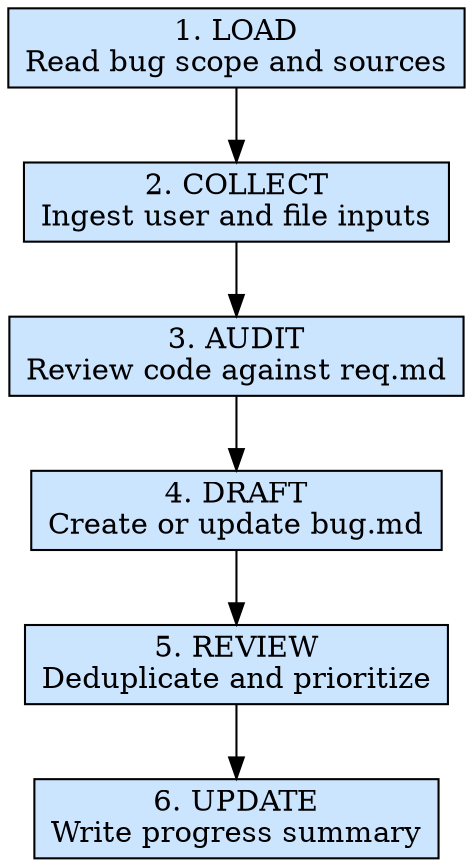

# 模块问题收集

## 概述

尽管目录名仍是 `step4-moduletest`，这个阶段的职责已经收敛为“收集问题并建档”，不是写测试用例，也不是修代码。

根据以下来源收集并整理 Bug：
- 开发者或用户口头描述的问题
- `.ai/missions/{module}/config.json` 中 `bugDocSources` 指向的文件或目录
- `.ai/missions/{module}/reqDocs/req.md` 与实际模块代码之间的差异审查

将结果统一沉淀到 `.ai/missions/{module}/bugDocs/bug.md`。交付物不是一句“这里可能有问题”，而是一份可追溯、可排序、可继续交给 `bug-fix` 的缺陷清单。

**核心原则：** 每个可行动的问题都要带上来源、现象和当前状态，写进 `bug.md` 后才算进入修复队列。

**违反规则的字面意思就是违反规则的精神。**

## 适用场景

**必须使用：**
- 模块开发或联调完成后，需要先盘点当前模块问题再进入修复
- 开发者、测试或用户零散说了一批问题，需要整理成结构化 Bug 文档
- `config.json` 中已经配置了 `bugDocSources`，需要把外部问题材料收口
- 需要对照 `reqDocs/req.md` 做一轮 AI 代码审查，提前发现明显缺口
- 上一轮修复后又出现新问题，需要继续往同一份 `bug.md` 中追加

**例外情况（需征询开发者）：**
- 问题本质上是需求未定、验收口径变化或产品策略调整
- 紧急 hotfix 且开发者明确要求先修后补记录
- 问题完全位于第三方系统、外部服务或基础设施层，当前仓库无法判断

想着“我先直接修，文档之后再补”？停下来。第四步的职责就是把问题边界收清楚；没收清楚就开始修，只会把范围越改越乱。

## 铁律

```text
EVERY ACTIONABLE BUG MUST BE WRITTEN TO bugDocs/bug.md BEFORE STEP5 STARTS
```

**没有例外：**
- 来源可以是 `USER_INPUT`、`bugDocSources`、`AI_AUDIT`
- 同一症状如果是不同根因，必须拆成不同 `BUG-*`
- 只有模糊怀疑、没有需求依据或代码证据时，不要伪装成“已确认 Bug”
- 第四步可以运行现有命令补强证据，但不能在这一阶段改业务代码或新写测试用例
- `bug.md` 顶部必须能一眼看到当前修复进度和优先处理项

## 违反后果

如果 `.ai/missions/{module}/bugDocs/bug.md` 不存在、没有覆盖本轮问题来源、缺少证据，或顶部进度摘要失真，本轮问题收集视为未完成；`bug-fix` 不应在这种上下文不完整的情况下启动。

## 执行流程



### 第 1 步：LOAD - 读取问题范围与来源

优先读取以下信息：
- `.ai/missions/{module}/config.json` - 读取 `bugDocSources`
- `.ai/missions/{module}/reqDocs/req.md` - 需求、页面结构、交互和验收标准
- `.ai/missions/{module}/apiDoc/api.md` - 接口契约、错误码和边界输入
- `.ai/missions/{module}/bugDocs/bug.md` - 历史 Bug 与当前修复进度
- `bugDocSources` 中列出的文件或目录 - 外部问题材料、日志、截图说明、补充文档
- `src/modules/{ModuleName}/` - 实际代码、现有测试、类型和依赖链路
- 开发者或用户当前消息 - 本轮新增问题线索

必须先确认：
- 本轮是“首次收集”，还是“在已有 `bug.md` 上增量追加”
- `bugDocSources` 中的路径是否真实存在；缺失路径不能被静默忽略
- `req.md` 是否足够定义预期行为；如果预期本身不清晰，应回到 `req-collect`
- 当前模块代码路径是否已经定位清楚

如果连模块位置、问题来源或需求预期都说不清，就不要假装已经完成审查；先补上下文。

**至少执行：**
- `test -d ".ai/missions/{module}"`
- `test -f ".ai/missions/{module}/config.json"`
- `find ".ai/missions/{module}" -maxdepth 3 -type f | sort`
- `find "src/modules/{ModuleName}" -maxdepth 4 -type f | sort`

### 第 2 步：COLLECT - 收口显式问题来源

先把明确提到的问题收进候选列表：
- 来自开发者或用户口述的问题：保留原意，不要把一句话拆成你自己的需求重写
- 来自 `bugDocSources` 的文件内容：给每条问题保留来源文件路径
- 来自已有 `bug.md` 的历史条目：保留原 `BUG-*` 编号和状态，不要重排

收口规则：
- 一个独立问题对应一个独立条目，不把“列表空态错、删除不刷新、弹窗样式偏移”塞进同一个 Bug
- 同一问题被多个来源重复提到时，合并为一个条目，但在 `来源` 或 `实际结果` 中保留多来源信息
- 只要问题能映射到“当前预期是什么、现在实际是什么”，就应该建条目
- 如果问题本质上是“需求不明确”，不要强行记成 Bug；应回到 `req-collect`

### 第 3 步：AUDIT - 对照 req.md 审查代码

默认采用“静态需求对码审查 + 必要时补强证据”的方式。建议按以下顺序检查：

1. 需求映射审查
   - 把每条 `REQ/AC` 映射到实际的布局、hooks、service、权限分支或交互入口
   - 缺少实现、实现方向相反、字段映射不一致，都应进入 Bug 候选
2. 状态与边界审查
   - 检查加载态、空态、错误态、权限态、禁用态、分页边界、空值和超长值
   - 检查快速重复点击、异步竞态、成功后未刷新、失败后状态未恢复
3. 数据与契约审查
   - 对照 `api.md`、`defs/type.ts`、`service.ts`、`useData`、布局使用处
   - 找出字段名错位、可空性假设错误、数据适配缺失、错误码处理缺口
4. 交互路径审查
   - 沿 `UI -> Layout -> useController -> service -> state update -> render` 追踪
   - 找出无绑定、条件分支写反、成功动作未回写状态、路由回跳异常等问题
5. 可选证据补强
   - 若仓库已有现成测试、lint、typecheck 或低成本复现命令，可定向运行以确认现象
   - 这一阶段可以验证问题，但不要扩展成“新写测试用例”任务，更不要顺手修代码

如果你没有把“预期行为”和“当前代码行为”做过对照，就不叫审查，只叫猜测。

### 第 4 步：DRAFT - 维护缺陷文档

以 `../../references/bug-doc-template.md` 为模板基线，生成或更新 `.ai/missions/{module}/bugDocs/bug.md`。

维护规则：
- 已有缺陷保留原 `BUG-*` 编号，不要改号或重排
- 新缺陷使用下一个可用的 `BUG-*`
- 新收集的问题默认写成 `OPEN`；只有确认受外部依赖阻塞时才写 `BLOCKED`
- 这一阶段的重点是把问题描述完整；`### 根因分析` 和 `### 修复方案` 不明确时可先写 `待 step5 分析`
- `### 回归结果` 初次收集时默认写 `PENDING`
- 顶部必须更新 `修复进度`、`本轮来源` 和 `优先处理`

填写约定：
- `来源`：可写 `用户反馈`、`bugDocSources`、`AI审查`，必要时写成组合来源
- `来源文件`：来自 `bugDocSources` 时写真实路径；没有则写 `无`
- `关联需求`：能映射到 `REQ-*` / `AC-*` 就写真实编号；纯口述问题可写 `USER_INPUT`
- `关联代码`：尽量写到具体模块文件或链路入口
- `复现环境`：如果只是静态审查发现，可写 `代码审查，未运行页面`
- `实际结果`：必须写看到的现象或代码证据，不写“感觉有问题”

示例：

```markdown
# 缺陷文档（bug.md）

- 模块名：fund-list
- 当前结论：本轮新增 2 个 OPEN 缺陷，需先处理删除链路和空值渲染问题
- 修复进度：OPEN 2 / FIXING 0 / FIXED 1 / BLOCKED 0 / WONT_FIX 0
- 本轮来源：USER_INPUT + config.json:bugDocSources + reqDocs/req.md audit
- 优先处理：BUG-003, BUG-004

## BUG-003

- 标题：删除成功后列表未刷新
- 严重级别：S1
- 来源：用户反馈 + AI审查
- 来源文件：无
- 状态：OPEN
- 关联需求：REQ-002 / AC-001
- 关联代码：src/modules/fund-list/hooks/useController.ts
- 关联接口：API-003
- 复现环境：本地联调环境，Chrome 136
- 剩余风险：新增、编辑成功后的刷新链路也可能受同一路径影响
- 是否关闭：否

### 问题描述

用户删除成功后仍然看到旧数据，刷新页面后才消失。

### 复现步骤

1. 打开列表页并准备至少 1 条可删除数据
2. 触发删除操作并等待成功提示
3. 观察列表是否立即刷新

### 期望结果

删除成功后，列表立即刷新且目标数据消失。

### 实际结果

代码链路显示删除成功后只有提示，没有重新触发列表查询；页面保留旧数据。

### 根因分析

待 step5 分析。

### 修复方案

待 step5 评估。

### 回归结果

- 回归状态：PENDING
- 回归说明：待进入 step5 修复后验证
```

### 第 5 步：REVIEW - 去重、分级、排优先级

在把文档交给 `bug-fix` 之前，至少完成以下收口：
- 按严重级别排序：`S0 -> S1 -> S2 -> S3`
- 检查是否存在“同一根因被拆成多条”或“多个独立问题被硬塞成一条”
- 确认每条问题都有来源、期望结果、实际结果和最小复现线索
- 对需求不明确的条目，不要冒充已确认 Bug
- 对缺失源文件、缺失环境或缺失接口上下文的条目，明确写出阻塞原因

### 第 6 步：UPDATE - 更新顶部修复进度摘要

完成收口后，更新 `.ai/missions/{module}/bugDocs/bug.md` 顶部摘要：
- `当前结论`：一句话描述本轮发现和当前焦点
- `修复进度`：按实际状态统计 `OPEN / FIXING / FIXED / BLOCKED / WONT_FIX`
- `本轮来源`：列出本轮实际使用的来源组合
- `优先处理`：列出下一步建议先修的 `BUG-*`

同时完成以下动作：
- 确认本轮显式来源都已处理，不留“我看过了但没写”的口袋问题
- 确认每个 `BUG-*` 都能映射到真实问题，不是空泛描述
- 对已有历史条目只做增量更新，不覆盖掉原有上下文
- 若本轮未发现明确 Bug，也保留文档并写清“未发现”的依据和剩余风险

**至少执行：**
- `test -f ".ai/missions/{module}/bugDocs/bug.md"`
- `rg -n "^## BUG-" ".ai/missions/{module}/bugDocs/bug.md"`

## 速查表

| 阶段 | 关键活动 | 完成标准 |
|------|---------|---------|
| LOAD | 读取需求、代码、配置和来源文件 | 问题范围明确，来源可追溯 |
| COLLECT | 收口口头问题和外部文件问题 | 显式输入都已进入候选列表 |
| AUDIT | 对照 `req.md` 审查代码 | 找到缺口、违背预期或高风险实现 |
| DRAFT | 生成或更新 `bugDocs/bug.md` | 每个问题都有结构化条目 |
| REVIEW | 去重、分级、排优先级 | Bug 清单可直接交给修复阶段 |
| UPDATE | 同步顶部进度摘要 | `bug.md` 顶部状态与条目真实一致 |

## 常见借口

| 借口 | 现实 |
|------|------|
| “这些问题我记在脑子里就行” | 下一轮最先丢掉的就是脑内上下文 |
| “先修一个大的，其他回头再说” | 你是在让修复范围失控，不是在提速 |
| “这个像 Bug，但我没时间写文档” | 没写进 `bug.md`，就不算进入队列 |
| “我已经跑过一遍了，没必要写来源” | 没有来源和证据，别人无法复核 |
| “代码一眼就能看出来有问题，直接改吧” | 第四步的职责是先收清楚，再交接修复 |

## 危险信号 - 立即停下来

- 你已经开始改代码，却还没生成 `bugDocs/bug.md`
- `bugDocSources` 有路径不存在，但你准备直接忽略
- 你把“需求未定义”伪装成“代码 Bug”
- 你把多个独立问题合并成一个 `BUG-*`
- 你没有对照 `req.md`，却开始凭经验判断“这里应该有问题”

## 参考文档

| 主题 | 文件 |
|------|------|
| 缺陷文档模板 | `../../references/bug-doc-template.md` |
| 问题发现与审查指南 | `references/bug-discovery-guide.md` |
| 缺陷文档填写规则 | `references/bug-doc-rules.md` |

## 集成关系

- **可选上游：** `req-collect`
- **直接上游：** `ui-dev`、`api-integrate`
- **主产物：** `.ai/missions/{module}/bugDocs/bug.md`
- **下游：** `bug-fix` 只消费已登记的 `BUG-*` 继续修复
