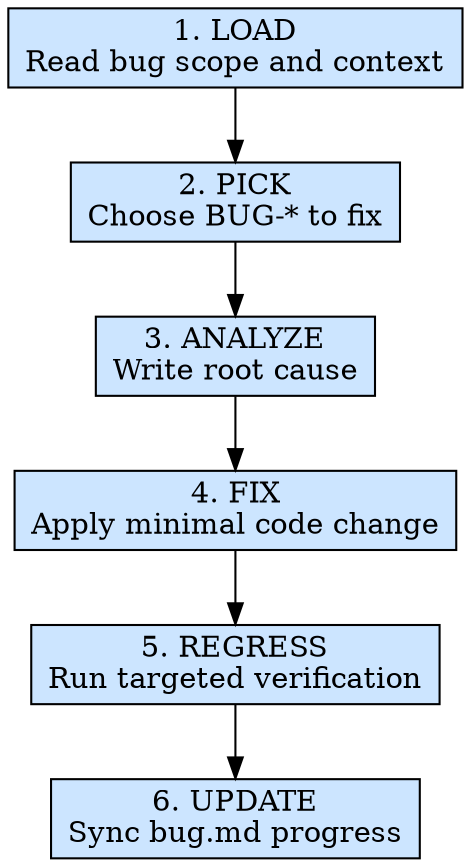

# 缺陷修复

## 概述

根据 `.ai/missions/{module}/bugDocs/bug.md` 中已经登记的 `BUG-*` 条目，选择本轮要处理的缺陷，完成根因分析、最小化修复、定向回归，并把修复进度回写到同一份 `bug.md`。

这个阶段只负责修复和推进文档进度，不负责收集新 Bug。新的问题来源、需求对码审查和问题建档，都属于 `module-test` 的职责。

**核心原则：** 每一处代码变更都必须能映射到已有 `BUG-*`；每一个宣称“已修复”的 Bug 都必须有回归结果。

**违反规则的字面意思就是违反规则的精神。**

## 适用场景

**必须使用：**
- `.ai/missions/{module}/bugDocs/bug.md` 中已有 `OPEN` 或 `FIXING` 的缺陷
- 上一轮问题收集已经完成，需要开始逐条修复
- 同一 Bug 的修复还没收口，需要继续推进 `FIXING`
- 历史 Bug 修复后需要做定向回归并更新文档状态

**例外情况（需征询开发者）：**
- 当前问题尚未登记进 `bug.md`
- 问题本质上是需求变更，而不是缺陷修复
- 缺陷位于第三方系统、外部服务或基础设施层，当前仓库无法直接修复
- `bug.md` 条目过于模糊，连预期和实际都说不清

想着“这个问题我知道在哪，直接改就行”？停下来。没有 `BUG-*`，就不是第五步的修复范围。

## 铁律

```text
ONLY FIX BUGS THAT ARE ALREADY REGISTERED IN bugDocs/bug.md
```

**没有例外：**
- 动代码前必须先锁定本轮要处理的 `BUG-*`
- 第五步不新增 `BUG-*`；如果回归时发现独立新问题，回到 `module-test` 建档
- 动代码前必须补齐或更新 `### 根因分析`
- 修复后必须回填 `### 修复方案` 和 `### 回归结果`
- 顶部 `修复进度`、`当前结论` 和 `优先处理` 必须随真实状态更新

## 违反后果

如果代码改动无法映射到已有 `BUG-*`，`bug.md` 没有同步根因和回归结果，或顶部进度摘要仍停留在旧状态，本轮缺陷修复视为未完成。

## 执行流程



### 第 1 步：LOAD - 读取缺陷范围与上下文

优先读取以下信息：
- `.ai/missions/{module}/bugDocs/bug.md` - 当前缺陷清单、状态、优先级和历史修复信息
- `.ai/missions/{module}/reqDocs/req.md` - 需求和验收标准，确认正确行为
- `.ai/missions/{module}/apiDoc/api.md` - 接口契约、错误码和边界输入
- `src/modules/{ModuleName}/` - 实际实现、现有测试代码和依赖链路
- 开发者补充的上下文 - 当前 Bug 的复现细节、截图、日志、控制台报错

必须先确认：
- 本轮到底修哪几个 `BUG-*`
- 这些条目是否都已有足够的复现和预期信息
- 哪些 Bug 共享同一根因，哪些是独立问题
- 哪些问题已经 `BLOCKED`，当前不应继续硬修

如果当前问题还没进 `bug.md`，不要在第五步顺手建条目；先回到第四步收口。

**至少执行：**
- `test -d ".ai/missions/{module}"`
- `test -f ".ai/missions/{module}/bugDocs/bug.md"`
- `find ".ai/missions/{module}" -maxdepth 3 -type f | sort`
- `find "src/modules/{ModuleName}" -maxdepth 4 -type f | sort`

### 第 2 步：PICK - 锁定本轮修复对象

按以下顺序挑选本轮修复范围：
1. `S0 -> S1 -> S2 -> S3`
2. `OPEN` 优先进入 `FIXING`
3. 共享同一根因的条目可以一并处理
4. 无关问题不要混在同一轮代码变更里

处理规则：
- 开始修复前，把目标条目状态改成 `FIXING`
- 顶部 `优先处理` 应反映当前还没解决的问题顺序
- 如果修到一半发现实际不是同一个问题，不要强行并单；回到第四步重新收口

### 第 3 步：ANALYZE - 先写根因，再动代码

针对每个目标 `BUG-*`，沿代码路径追踪到第一个出错环节，并把结论写进 `### 根因分析`。

优先从以下角度排查：
1. 数据流：Layout -> hooks -> service -> API response
2. 事件流：UI 事件 -> useController -> 状态更新 -> re-render
3. 类型链：`defs/type.ts`、`service.ts`、hooks 和布局是否一致
4. 样式链：CSS Modules、容器布局、UI 库覆盖、响应式分支
5. 副作用链：请求触发时机、依赖项、清理逻辑、竞态问题

要求：
- `根因分析` 必须解释“为什么会错”，不是只重复“哪里错了”
- 能定位到文件、字段、条件分支或时序问题，就不要停留在笼统描述
- 如果根因仍不明确，宁可继续调查，也不要提前写修复代码

### 第 4 步：FIX - 做最小且正确的修复

针对根因实施最小化变更：
- 修源头，不修表面症状
- 修类型链时，让 `type.ts`、`service.ts`、hooks 和布局保持一致
- 同一问题尽量在根因所在文件修复，不要在下游堆补丁
- 如果仓库已有测试栈，可补最小必要的回归验证代码，但不要把这一步扩展成独立测试文档任务

禁止行为：
- 到处增加防御性空值判断，却不解释为什么会空
- 用 `try-catch`、`setTimeout`、`as any` 掩盖真实问题
- 借修 Bug 之机做无关重构
- 为了让测试“先过”而篡改业务预期

### 第 5 步：REGRESS - 定向回归验证

修复后必须重跑受影响范围：
1. 当前 `BUG-*` 的直接复现路径
2. 同一代码路径下的关键相邻场景
3. 根因分析中提到的边界场景

执行规则：
- 自动化验证：优先重跑相关测试文件、相关 case 或新增的最小回归测试
- 手动验证：按 `bug.md` 的 `复现步骤` 重新确认
- 记录命令、环境、关键断言或观察结论
- 如果回归暴露了独立新问题，不要在第五步新建 `BUG-*`；回到第四步登记

记录要求：
- `### 回归结果` 中写明 `PASS` / `FAIL` / `BLOCKED`
- 回归失败时，不得把状态改成 `FIXED`
- 回归过程中发现的新风险，可写入当前条目的 `剩余风险`

### 第 6 步：UPDATE - 同步修复进度

修复或回归完成后，至少同步以下内容：
- 更新 `.ai/missions/{module}/bugDocs/bug.md`
- 更新目标 `BUG-*` 的 `状态`、`是否关闭`、`根因分析`、`修复方案`、`回归结果`
- 更新顶部 `当前结论`、`修复进度` 和 `优先处理`
- 如当前 Bug 已修完，明确剩余未解问题是什么

状态建议：
- `OPEN`：已记录，尚未开始修复
- `FIXING`：正在处理，但还没完成回归
- `FIXED`：修复完成且回归通过
- `BLOCKED`：受外部依赖阻塞，当前无法继续
- `WONT_FIX`：明确决定不修，并记录理由

**至少执行：**
- `test -f ".ai/missions/{module}/bugDocs/bug.md"`
- `rg -n "^## BUG-" ".ai/missions/{module}/bugDocs/bug.md"`

## 速查表

| 阶段 | 关键活动 | 完成标准 |
|------|---------|---------|
| LOAD | 读取缺陷、需求和代码上下文 | 修复范围明确，条目真实存在 |
| PICK | 选择本轮 `BUG-*` | 目标清楚，状态已切到 `FIXING` |
| ANALYZE | 写出根因分析 | 能解释缺陷为什么发生 |
| FIX | 实施最小变更 | 修复定位准确，不靠下游补丁 |
| REGRESS | 重跑受影响范围 | 有真实回归结果和证据 |
| UPDATE | 同步 `bug.md` 进度 | 顶部摘要和条目状态一致 |

## 常见借口

| 借口 | 现实 |
|------|------|
| “这个问题很小，不用挂 `BUG-*`” | 没有编号，就没有边界和回归 |
| “我先改完再补根因” | 先写根因，才能判断是不是在修源头 |
| “顺手把旁边也一起改了” | 你在扩大风险面，不是在修 Bug |
| “回归结果晚点再补” | 没有回归记录的 `FIXED` 没有意义 |
| “这是新问题，但我就顺手一起修了” | 第五步不负责新增问题收集 |

## 危险信号 - 立即停下来

- 你还没锁定 `BUG-*`，就开始改代码
- 你准备通过增加兜底逻辑来“压住”错误
- 你把状态改成 `FIXED`，但没有回归记录
- 回归时发现独立新问题，却打算继续在当前条目里硬并
- 你更新了代码，却没同步 `bug.md` 顶部进度摘要

## 参考文档

| 主题 | 文件 |
|------|------|
| 通用规则 | `../../references/rules/common-rules.md` |
| 缺陷文档模板 | `../../references/doc-templates/bug-doc-template.md` |
| 缺陷文档填写规则 | `../../references/rules/step5-bug-doc-rules.md` |
| 缺陷分析指南 | `references/bug-triage-guide.md` |

## 集成关系

- **直接上游：** `module-test`
- **主产物：** 代码修复 + `.ai/missions/{module}/bugDocs/bug.md`
- **如发现新问题：** 回到 `module-test` 先登记，再决定是否继续修复
