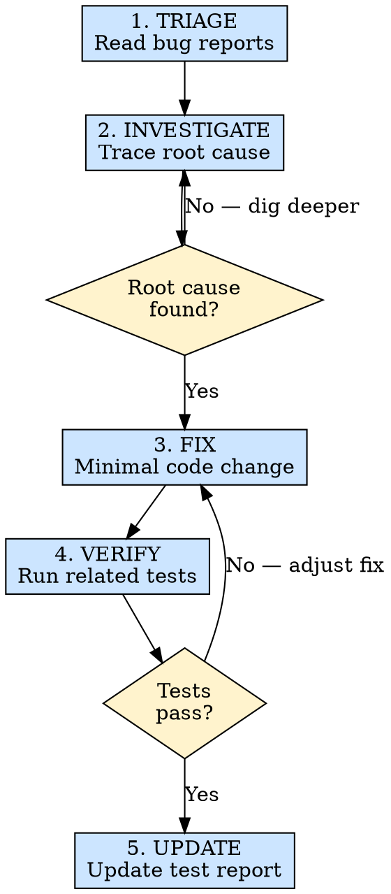

# 缺陷修复

## 概述

通过根因分析系统性地调查和修复缺陷清单中的问题，绝不靠猜测碰运气。修复目标是清理 `module-test` 暴露出的失败项，并为回归验证做好准备。

**核心原则：** 在动代码之前理解根本原因，才能避免"修一个坏两个"的恶性循环。

**违反规则的字面意思就是违反规则的精神。**

## 适用场景

**必须使用：**
- `bugDoc/bug.md` 中已有待修复缺陷
- 开发者报告了需要修复的具体缺陷
- 历史测试结果或回归验证暴露了明确问题

**例外情况（需征询开发者）：**
- 问题出在第三方库中（应向上游报告）
- 缺陷需要重新设计架构（应先讨论方案）

想着"我知道问题在哪，让我快速改一下"？停下来。先用证据验证你的假设。

## 铁律

```
NO ROOT CAUSE ANALYSIS = NO CODE CHANGES — "TRY AND SEE" DEBUGGING IS FORBIDDEN
```

想加一个快速修复？先把根本原因写下来。如果你无法解释缺陷**为什么**发生，说明你还没有真正理解它。

**没有例外：**
- 不要"以防万一"地加空值检查——找出它**为什么**是 null
- 不要用 try-catch 掩盖错误——找出**什么**导致了错误
- 不要用 setTimeout 修复竞态条件——找到**真正的**时序问题
- 不要从"能用的"模块复制代码——理解其中的**差异**

## 执行流程



### 第 1 步：分诊

阅读缺陷清单：
- `.ai/missions/{missionId}/bugDoc/bug.md` — 标记为需修复的缺陷
- `.ai/missions/{missionId}/testDoc/test.md` — 最近一轮测试上下文（如有）

针对每个缺陷，收集以下信息：
- 缺陷 ID 和描述
- 关联的验收标准（REQ/AC）
- 复现步骤
- 严重等级
- 疑似原因（来自测试报告）

按优先级排序：Critical > High > Medium > Low。

### 第 2 步：调查

针对每个缺陷，追踪根本原因：

1. **阅读失败的代码路径**：从症状出发，逆向追踪
2. **跟踪数据流**：错误的数据从哪里来的？
   - Layout 收到了错误的 prop？→ 检查 hooks/index.ts
   - Hook 返回了错误的值？→ 检查 useData 或 useController
   - Service 返回了意外的数据？→ 对比 API 响应与 type 定义
3. **检查类型链**：是否存在类型不匹配？
4. **检查组件 props**：组件是否收到了预期的数据？
5. **检查条件逻辑**：条件判断是否正确？

记录根本原因：
```
BUG-001 Root Cause:
- Symptom: Date shows "Invalid Date" in table
- Path: Layout → _.list[n].createdAt → useData.processedList → API response
- Root cause: API returns timestamp (number) but type declares string.
  useCreation doesn't transform it, layout passes raw number to date formatter.
- Fix: Add dayjs(timestamp).format() in useData.processedList transformation
```

### 第 3 步：修复

针对根本原因实施最小化修复：

规则：
- **最小变更**：只修改出问题的部分。不要顺便重构周围的代码。
- **同一文件**：修复应在根因所在的文件中进行，而非在下游做变通处理。
- **类型安全**：如果修复暴露了类型不匹配的问题，同时修复类型定义。
- **禁止创可贴式修复**：不要添加防御性空值检查、try-catch 或兜底值，除非那**本身**就是正确的修复方式。

### 第 4 步：验证

重新运行失败的特定测试：
- 自动化测试：运行测试套件，检查对应的测试用例
- 手动测试：按照复现步骤操作，确认缺陷已修复

同时运行相关测试：
- 同一 REQ 下的其他 AC
- 经过同一代码路径的测试
- 针对已修复功能的边界情况测试

### 第 5 步：更新

更新缺陷文档：
- 将 AC 状态从 FAIL 改为 PASS
- 将缺陷条目状态从 OPEN 改为 FIXED
- 记录修复了什么以及在哪个文件中修复的
- 如果修复引入了新的注意事项，添加到报告中

## 速查表

| 阶段 | 关键活动 | 成功标准 |
|------|---------|---------|
| 分诊 | 阅读缺陷报告，确定优先级 | 缺陷已按严重程度排序 |
| 调查 | 追踪数据流，定位根本原因 | 写出根因分析说明 |
| 修复 | 最小化的定向代码变更 | 只有出问题的代码被修改 |
| 验证 | 重新运行失败的测试及相关测试 | 所有相关测试通过 |
| 更新 | 更新缺陷文档和状态 | 文档反映当前状态 |

## 常见借口

| 借口 | 现实 |
|-----|------|
| "我知道问题在哪" | 还是写下来吧——这能迫使你的思路更清晰 |
| "直接试更快" | 盲目尝试有 40% 的概率引入新缺陷 |
| "修复方法很明显" | 跳过验证的"明显"修复会遗漏副作用 |
| "现在能用了" | 不理解为什么能用，它随时可能再坏 |
| "我之后再调查" | 你现在掌握的上下文比明天更新鲜 |

## 危险信号 -- 立即停下来

- 你在添加空值检查，却不理解为什么值是 null
- 你在尝试第二个修复方案，因为第一个"没完全起效"
- 你在修改一个离症状出现位置很远的文件
- 你无法用一句话解释缺陷为什么发生
- 你在第三次修复同一个缺陷

## 遇到瓶颈时

| 问题 | 解决方案 |
|-----|---------|
| 无法复现 | 检查测试环境是否与报告中的条件一致 |
| 根因不明 | 在数据流的关键节点添加 console.log/debugger |
| 修复导致其他测试失败 | 根因分析不完整——回到第 2 步 |
| 缺陷出在第三方代码中 | 向用户报告，建议使用变通方案或升级库 |
| 多个缺陷相互交织 | 逐个修复，每次修复后都验证 |

## 参考文档

| 主题 | 文件 |
|-----|------|
| 缺陷分析指南 | `references/bug-triage-guide.md` |

## 集成关系

- **依赖：** `module-test` 输出的失败项、`bugDoc/bug.md`，或开发者提供的明确缺陷信息
- **修复后：** 重新运行受影响范围的回归验证；如需完整复测，再回到 `module-test`
