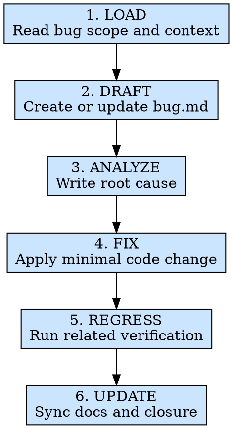

# 缺陷修复

## 概述

根据 `.ai/missions/{module}/bugDoc/bug.md`、`.ai/missions/{module}/testDocs/test.md` 或开发者明确给出的缺陷信息，先生成或更新缺陷文档，再完成根因分析、最小化修复、回归验证，并把结果回写到 `bug.md` 和关联测试条目中。交付物不是一句“已经修好了”，而是一条有根因、有修复方案、有回归结果的缺陷闭环。

**核心原则：** 没有写进 `bug.md` 的缺陷状态，不算被管理；没有回归证据的“修复完成”，不算完成。

**违反规则的字面意思就是违反规则的精神。**

## 适用场景

**必须使用：**
- `.ai/missions/{module}/bugDoc/bug.md` 中已有待修复缺陷
- `module-test` 暴露出 `FAIL` 项，需要进入缺陷修复
- 开发者、测试或用户明确给出了可复现的问题
- 历史缺陷修复后需要做定向回归
- 上一轮修复不完整，需要继续推进同一批 Bug

**例外情况（需征询开发者）：**
- 问题实际属于需求变更，而不是缺陷修复
- 缺陷在第三方系统、外部服务或基础设施层，当前仓库无法直接修复
- 问题描述过于模糊，无法定位模块或复现路径

想着“我知道问题在哪，让我快速改一下”？停下来。先把缺陷条目补完整，再动代码。

## 铁律

```text
EVERY FIXED BUG MUST HAVE A ROOT CAUSE AND A REGRESSION RESULT
```

你可以让缺陷保持 `OPEN`、`FIXING`、`BLOCKED` 或 `WONT_FIX`，但不能跳过记录环节，直接宣称“已修复”。

**没有例外：**
- 动代码前必须把缺陷写入 `.ai/missions/{module}/bugDoc/bug.md`
- 动代码前必须写出 `### 根因分析`，不能靠“试试看”调试
- 修复后必须回填 `### 回归结果`
- 关联测试存在时，必须同步更新 `.ai/missions/{module}/testDocs/test.md`
- 不要把临时 workaround 伪装成根因修复

## 违反后果

如果 `bug.md` 中没有本轮缺陷、缺少根因分析、没有回归结果，或相关测试条目仍然停留在旧状态，本轮缺陷修复视为未完成；在继续发布或进入下一轮测试前，必须先补齐文档和回归闭环。

## 执行流程



### 第 1 步：LOAD - 读取缺陷范围与上下文

优先读取以下信息：
- `.ai/missions/{module}/bugDoc/bug.md` - 当前缺陷清单与历史修复状态
- `.ai/missions/{module}/testDocs/test.md` - 对应失败用例、复现步骤和最近一轮测试上下文
- `.ai/missions/{module}/reqDocs/req.md` - 需求和验收标准，确认“预期行为”是什么
- `.ai/missions/{module}/apiDoc/api.md` - 接口契约、错误码和边界输入
- `src/modules/{ModuleName}/` - 实际实现、测试代码和相关依赖链路
- 开发者补充的缺陷描述、截图、录屏、控制台报错 - 本轮新增上下文

必须先确认：
- 本轮修复范围是“已有 Bug 条目”，还是“用户新增缺陷”
- 每个缺陷是否能映射到具体 `BUG-*`、`TC-*` / `MC-*` 或 `REQ/AC`
- 缺陷是逻辑问题、数据问题、样式问题、权限问题，还是环境阻塞
- 当前 `bug.md` 是否存在；不存在时需要先按模板创建

如果只有一句“这里不对”，却没有模块位置、复现方式或预期行为，不要直接改代码；先把缺失信息补到缺陷条目里。

**至少执行：**
- `test -d ".ai/missions/{module}"`
- `find ".ai/missions/{module}" -maxdepth 3 -type f | sort`
- `find "src/modules/{ModuleName}" -maxdepth 4 -type f | sort`

### 第 2 步：DRAFT - 维护缺陷文档

以 `../../references/bug-doc-template.md` 为模板基线，生成或更新 `.ai/missions/{module}/bugDoc/bug.md`。

维护规则：
- 已有缺陷保留原 `BUG-ID`，不要改号或重排
- 新缺陷使用下一个可用的 `BUG-*`
- 如果缺陷来自 `testDocs/test.md` 的失败项，`来源` 填 `测试`，并写入 `关联测试`
- 如果缺陷来自开发者或用户反馈，保留真实来源，如 `开发者`、`用户反馈`
- 动代码前，状态至少应为 `OPEN` 或 `FIXING`
- 修复后且回归通过，状态才可以改为 `FIXED`
- 明确决定不修时才可写 `WONT_FIX`
- 受外部依赖阻塞时写 `BLOCKED`
- `是否关闭` 必须与状态一致；`FIXED` / `WONT_FIX` 才能写 `是`

每个条目至少补齐：
- `标题`
- `严重级别`
- `来源`
- `状态`
- `关联需求`
- `关联测试`
- `关联接口`
- `复现环境`
- `剩余风险`
- `### 复现步骤`
- `### 期望结果`
- `### 实际结果`
- `### 根因分析`
- `### 修复方案`
- `### 回归结果`

示例：

```markdown
# 缺陷文档（bug.md）

- 模块名：fund-list
- 当前结论：仍有 1 个 OPEN 缺陷，需继续回归

## BUG-001

- 标题：空列表时页面白屏
- 严重级别：S1
- 来源：测试
- 状态：FIXING
- 关联需求：REQ-001
- 关联测试：TC-001
- 关联接口：API-001
- 复现环境：本地 mock 环境，Chrome 136
- 剩余风险：其他空值字段仍需回归
- 是否关闭：否

### 复现步骤

1. 准备空列表返回
2. 打开模块页面

### 期望结果

页面展示空状态，不崩溃。

### 实际结果

页面渲染时报错，控制台显示读取 `list.length` 失败。

### 根因分析

`useData` 中假设 `res.data.list` 一定为数组，未处理接口返回 `null` 的情况。

### 修复方案

在 `useData` 中补齐 `res.data?.list ?? []` 的映射，并同步更新相关类型。

### 回归结果

- 回归状态：待回归
- 回归说明：待修复完成后重跑 TC-001 和空值边界场景
```

### 第 3 步：ANALYZE - 先写根因，再动代码

针对每个缺陷，沿代码路径追踪到第一个出错环节，并把结论写进 `### 根因分析`。

优先从以下角度排查：
1. 数据流：Layout -> hooks -> service -> API response
2. 事件流：UI 事件 -> useController -> 状态更新 -> re-render
3. 类型链：`defs/type.ts` 是否和真实数据一致
4. 样式链：CSS Modules -> classNames -> 容器布局 -> UI 库覆盖
5. 副作用链：`useWatcher`、请求触发时机、清理逻辑

要求：
- `根因分析` 必须解释“为什么会错”，不是只重复“哪里错了”
- 能定位到文件、字段、条件分支或时序问题，就不要停留在笼统描述
- 如果根因仍不明确，先补调查信息，不要提前写修复代码

### 第 4 步：FIX - 做最小且正确的修复

针对根因实施最小化变更：
- 修源头，不修表面症状
- 修类型链时，要让 `type.ts`、`service.ts`、hook 和布局保持一致
- 同一问题尽量在根因所在文件修复，而不是在下游打补丁
- 如果修复需要新增或调整测试，优先补到现有 `TC-*`

禁止行为：
- 到处增加防御性空值判断，却不解释为什么会空
- 用 `try-catch`、`setTimeout`、`as any` 掩盖真实问题
- 借修 Bug 之机做无关重构
- 为了“让测试先过”而修改业务预期

### 第 5 步：REGRESS - 定向回归验证

修复后必须重跑受影响范围：
1. 对应 `BUG-*` 直接关联的 `TC-*` / `MC-*`
2. 同一代码路径下的其他关键测试
3. 已知的边界场景和相邻功能

执行规则：
- 自动化测试：重跑相关测试文件或相关 case
- 手动测试：按 `bug.md` 或 `test.md` 中的复现步骤重新验证
- 如果发现原来的 `testDocs/test.md` 缺少这个回归点，补上最小必要的测试条目后再记录结果

记录要求：
- `### 回归结果` 中写明回归状态和说明
- 相关 `testDocs/test.md` 条目要同步更新 `实际结果`、`状态` 和 Bug 关联
- 回归失败时，不得把 `状态` 改成 `FIXED`

### 第 6 步：UPDATE - 闭环并同步文档

修复或回归完成后，至少同步以下内容：
- 更新 `.ai/missions/{module}/bugDoc/bug.md`
- 更新相关 `.ai/missions/{module}/testDocs/test.md` 条目
- 如有新增失败现象，追加新的 `BUG-*`，不要复写旧条目
- 顶部 `当前结论` 要反映真实状态，而不是乐观判断

状态建议：
- `OPEN`：已记录，尚未开始修复
- `FIXING`：正在处理，但还没完成回归
- `FIXED`：修复完成且回归通过
- `BLOCKED`：受外部依赖阻塞，当前无法继续
- `WONT_FIX`：明确决定不修，并记录理由

**至少执行：**
- `test -f ".ai/missions/{module}/bugDoc/bug.md"`
- `rg -n "^## BUG-" ".ai/missions/{module}/bugDoc/bug.md"`

## 速查表

| 阶段 | 关键活动 | 完成标准 |
|------|---------|---------|
| LOAD | 读取缺陷、测试和代码上下文 | 修复范围明确，来源可追溯 |
| DRAFT | 生成或更新 `bugDoc/bug.md` | 每个缺陷都有结构化条目 |
| ANALYZE | 写出根因分析 | 能解释缺陷为什么发生 |
| FIX | 实施最小变更 | 修复定位准确，不靠下游补丁 |
| REGRESS | 重跑受影响测试 | 有真实回归结果和证据 |
| UPDATE | 同步 bug 文档和测试文档 | `bug.md` 与 `test.md` 反映真实状态 |

## 常见借口

| 借口 | 现实 |
|------|------|
| “我已经知道怎么改了” | 先写根因，才能判断是不是在修源头 |
| “这个 Bug 不复杂，不用建条目” | 没有条目，就没有后续回归和状态管理 |
| “我先把状态改 FIXED，回归晚点补” | 没有回归结果的 FIXED 没有意义 |
| “顺手把旁边一起重构了” | 你在扩大风险面，而不是缩小修复面 |
| “测试文档不更新也没关系” | 下轮回归时，第一个丢掉的就是上下文 |

## 危险信号 - 立即停下来

- 你还没写 `### 根因分析`，就开始改代码
- 你准备通过增加兜底逻辑来“压住”错误
- 你把缺陷状态改成 `FIXED`，但没有回归记录
- 你更新了 `bug.md`，却没同步相关 `test.md`
- 你删除了旧缺陷条目，而不是保留历史状态

## 参考文档

| 主题 | 文件 |
|------|------|
| 缺陷文档模板 | `../../references/bug-doc-template.md` |
| 缺陷文档填写规则 | `references/bug-doc-rules.md` |
| 缺陷分析指南 | `references/bug-triage-guide.md` |

## 集成关系

- **直接上游：** `module-test`
- **主产物：** `.ai/missions/{module}/bugDoc/bug.md`
- **联动更新：** `.ai/missions/{module}/testDocs/test.md`
- **修复后：** 重新运行受影响范围的回归验证；如需完整复测，再回到 `module-test`
