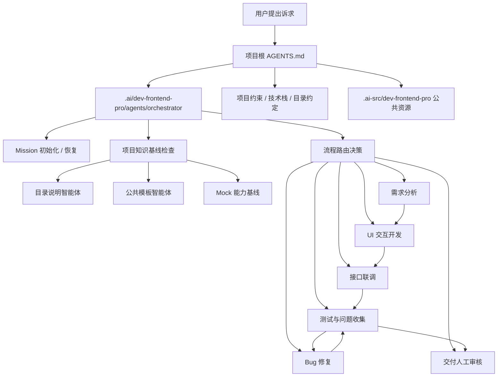
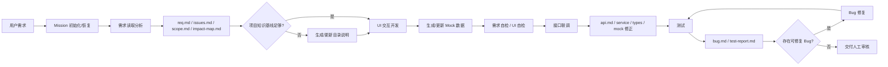
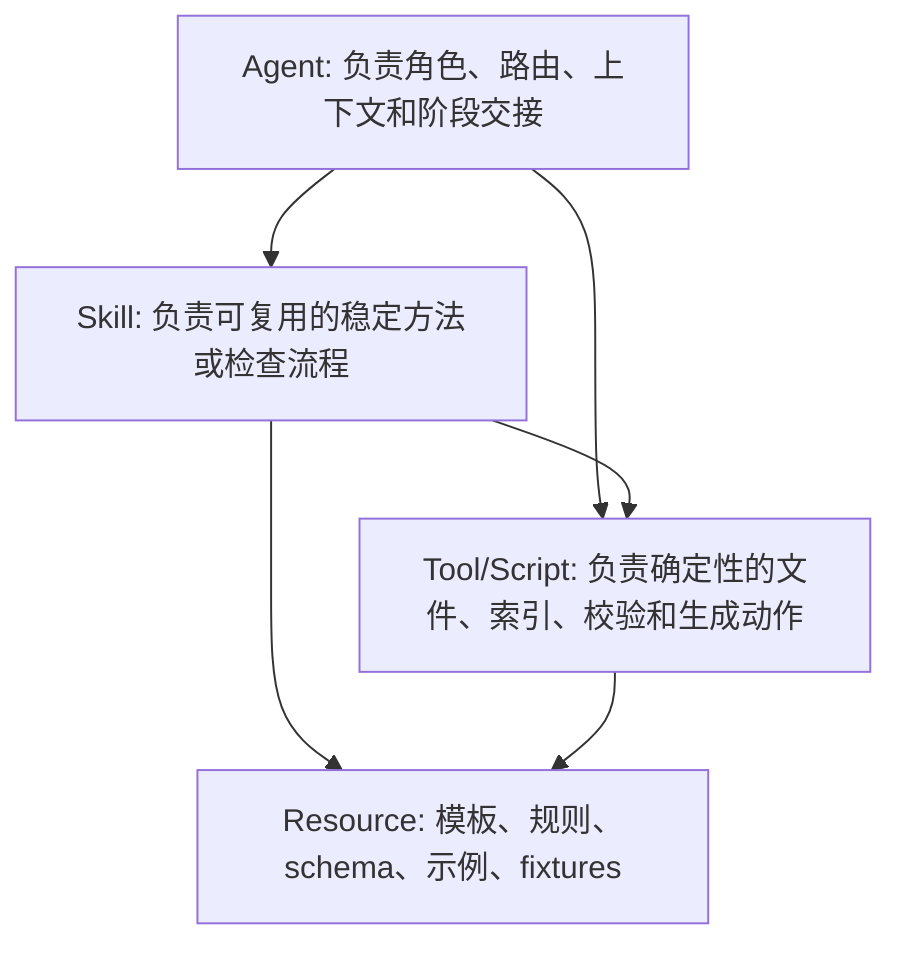
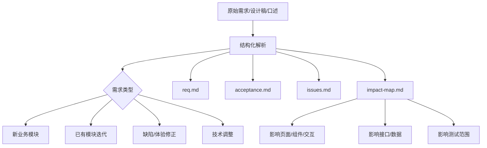
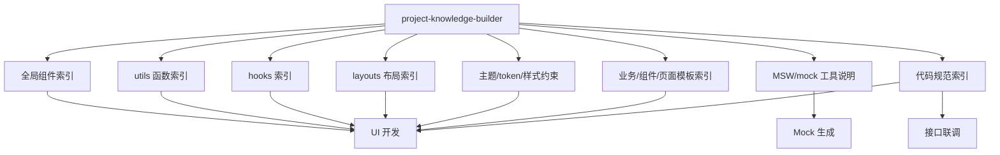
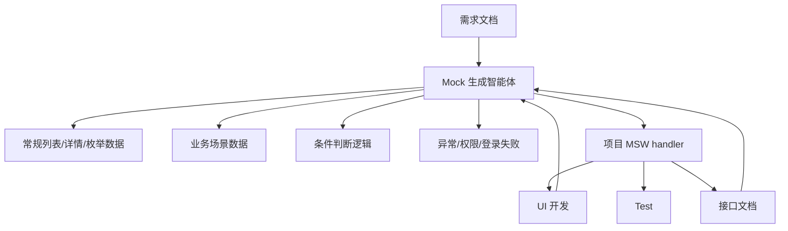
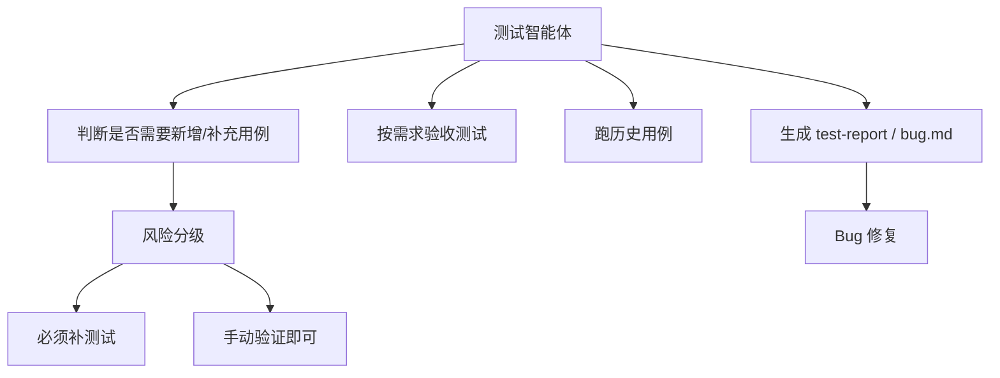

# dev-frontend-pro 架构计划

## 当前共识

- `dev-frontend-pro` 是 `packages/dev-frontend` 的第二套前端工作流智能体集合。
- 旧版满意度约 70%，新版重点解决架构关系、上下文质量、项目知识复用、Mock 质量、测试策略和流程可控性。
- 主入口不依赖 hook。项目根 `AGENTS.md` 负责告诉 AI 如何进入 `.ai` 中的智能体；hook 只作为可选增强，不作为流程正确性的前置条件。
- 智能体运行入口放在目标项目的 `.ai/` 下。
- AI 公共资源、模板、规则、索引源文件、mission 产物和其他 AI 生成资料放在目标项目的 `.ai-src/` 下。
- `.ai` 更像“可调用入口层”，`.ai-src` 更像“项目拥有的 AI 资料库”。

## 入口策略

推荐主路径：

1. 用户向 AI 提出诉求。
2. AI 读取项目根目录 `AGENTS.md`。
3. `AGENTS.md` 指向 `.ai/dev-frontend-pro/agents/orchestrator/AGENTS.md`。
4. Orchestrator 先执行入口自检，再根据当前诉求、mission 状态、项目知识基线和可用资源，选择后续智能体。

## 首次进入自检

首次进入项目时，根目录 `AGENTS.md` 或 orchestrator 必须先做 Bootstrap Gate。

检查项：

- `.ai/dev-frontend-pro/agents/orchestrator/AGENTS.md` 是否存在。
- `.ai-src/dev-frontend-pro/` 是否存在。
- `.ai-src/dev-frontend-pro/missions/` 是否存在。
- 当前是否有明确的 `missionId` 或需要新建 mission。
- 如果继续旧任务，`.ai-src/dev-frontend-pro/missions/{missionId}/config.json` 是否存在。
- `config.json` 中是否具备本轮需要的最低字段，例如 `projectRoot`、`moduleRoot`、`module.name`、`moduleTemplate`、需求/API/Bug 来源等。

处理规则：

| 缺失内容 | 处理方式 |
|---|---|
| `.ai` 智能体入口缺失 | 告警并停止，提示需要先安装或链接 `dev-frontend-pro` 智能体 |
| `.ai-src` 缺失 | 询问是否初始化项目 AI 资料库 |
| `missions` 目录缺失 | 可自动创建，创建前说明目标路径 |
| 没有 `missionId` | 新需求默认询问是否新建 mission；继续任务则要求用户提供 mission |
| `config.json` 缺失或字段不足 | 只询问本轮最低必要参数，不一次性索取所有字段 |
| 项目知识基线缺失 | 不阻塞需求分析；进入 UI 开发前必须告警并决定是否先生成 |

不建议把 hook 作为主入口，原因：

- 不同 CLI 工具的 hook 机制、生命周期和安装方式不一致。
- hook 往往需要额外安装或授权，迁移成本高。
- hook 的触发时机不一定适合交互式需求分析。
- hook 更适合做自动校验、索引更新、提交前检查等增强能力。

hook 推荐定位：

- 可选触发项目知识索引更新。
- 可选做提交前自检。
- 可选检查 `.ai` / `.ai-src` 资源是否缺失。
- 不承担主流程启动职责。

## 目录分层

```text
.ai/
├── dev-frontend-pro/
│   ├── agents/
│   │   ├── orchestrator/
│   │   ├── requirement-analyst/
│   │   ├── project-knowledge-builder/
│   │   ├── template-builder/
│   │   ├── ui-developer/
│   │   ├── mock-builder/
│   │   ├── api-integrator/
│   │   ├── test-planner-runner/
│   │   └── bug-fixer/
│   ├── skills/
│   └── hooks/

.ai-src/
├── dev-frontend-pro/
│   ├── docs/
│   │   ├── rules/
│   │   ├── indexes/
│   │   ├── templates/
│   │   └── examples/
│   ├── missions/
│   │   └── {missionId}/
│   │       ├── config.json
│   │       ├── reqDocs/
│   │       ├── apiDocs/
│   │       ├── testDocs/
│   │       ├── bugDocs/
│   │       └── reports/
│   ├── templates/
│   │   ├── modules/
│   │   ├── components/
│   │   ├── pages/
│   │   ├── hooks/
│   │   ├── mocks/
│   │   └── tests/
│   ├── schemas/
│   ├── tools/
│   ├── fixtures/
│   ├── references/
│   └── scripts/
```

分层原则：

- `.ai`：放 AI 可直接调用的智能体、skills、hooks。
- `.ai-src`：放公共资源、模板、规则、示例、知识索引源文件、mission 产物和 AI 生成资料。
- mission 产物隔离在 `.ai-src/dev-frontend-pro/missions/{missionId}`，避免不同任务互相污染。
- 项目级长期知识沉淀放 `.ai-src/dev-frontend-pro/docs/indexes/`，不要重复写进每个 mission。
- `.ai-src/dev-frontend-pro/missions/` 是任务级产物区，`.ai-src/dev-frontend-pro/docs/` 和 `templates/` 是项目级长期资产区，二者不能混写。

## 总入口关系图



## 标准需求迭代流程



完整链路：

1. 需求读取分析
2. UI 交互开发
3. 接口联调
4. 测试
5. Bug 修复
6. 交付人工审核

允许按需跳步，但每次跳步必须通过 orchestrator 的交接关卡判断。
AI 不自动提交代码，也不提供 `commit-agent`。最终提交由开发者人工审核后决定。

## 智能体职责

| 智能体 | 位置 | 核心职责 |
|---|---|---|
| orchestrator | `.ai/dev-frontend-pro/agents/orchestrator` | 总调度、路由、阶段关卡、恢复任务 |
| requirement-analyst | `.ai/dev-frontend-pro/agents/requirement-analyst` | 需求结构化、澄清项、验收标准、影响面分析 |
| project-knowledge-builder | `.ai/dev-frontend-pro/agents/project-knowledge-builder` | 生成和更新目录说明、组件索引、utils、hooks、layouts、主题、mock 工具说明 |
| template-builder | `.ai/dev-frontend-pro/agents/template-builder` | 根据项目生成业务模块、组件、页面、hook、mock、test 模板 |
| ui-developer | `.ai/dev-frontend-pro/agents/ui-developer` | 基于需求、模板和项目知识开发 UI 与交互 |
| mock-builder | `.ai/dev-frontend-pro/agents/mock-builder` | 基于需求/API/MSW 工具生成 mock 数据和场景逻辑 |
| api-integrator | `.ai/dev-frontend-pro/agents/api-integrator` | 根据接口文档更新类型、service、hooks 和 mock |
| test-planner-runner | `.ai/dev-frontend-pro/agents/test-planner-runner` | 判断测试策略、补必要用例、执行需求验收和历史回归 |
| bug-fixer | `.ai/dev-frontend-pro/agents/bug-fixer` | 基于 bug 文档修复问题并回写状态 |

## Agent / Skill / Tool 分层

这里使用 agent 不是因为名称偏好，而是因为新版工作流需要“角色 + 过程控制 + 多阶段判断 + 调用下层能力”。

推荐分层：



建议边界：

| 类型 | 适合放什么 | 示例 |
|---|---|---|
| Agent | 面向一类任务的负责人，能调用多个 skill/tool，也能决定是否交给其他 agent | `orchestrator`、`ui-developer`、`api-integrator` |
| Skill | 可复用的工作方法、检查清单、决策规则，通常不绑定单一任务入口 | 需求质量检查、影响面分析、组件选择、Mock 场景设计、测试风险分级 |
| Tool/Script | 可确定执行的脚本或命令，输出可验证 | 初始化 mission、生成索引、校验 config、扫描组件导出、检查模板占位符 |
| Resource | 被 agent/skill/tool 消费的静态资产 | Markdown 模板、JSON Schema、示例模块、规则文档、fixtures |

一个 agent 可以调用多个子 agent；子 agent 可以调用多个 skill；skill 可以调用工具和读取资源。这个认知是合理的。

## 需求分析增强

需求分析阶段需要比旧版更强，避免交互缺失、验收标准不完整和 AI 自行脑补。

建议产物：

- `reqDocs/req.md`：结构化需求。
- `reqDocs/issues.md`：待澄清问题。
- `reqDocs/scope.md`：本轮范围与非本轮范围。
- `reqDocs/impact-map.md`：需求影响面映射。

`scope.md` 的作用：

- 明确本轮要做什么、不做什么。
- 区分新业务、已有模块迭代、缺陷修正、技术调整。
- 记录本轮停止点，例如“只做到 UI 开发，不进入接口联调”。
- 避免 AI 在开发、测试或修 bug 时顺手扩大范围。

`impact-map.md` 的作用：

- 把每条需求映射到页面、组件、状态、接口、权限、异常、测试范围。
- 显式记录“这条需求会影响哪些代码和交互链路”。
- 防止 AI 读需求时只记住主流程，漏掉产品文档里已经写明的边界交互。
- 给 UI 开发、接口联调、测试和 bug 审查提供同一张追踪表。

理论上 AI 可能会在脑中想到影响面，但不明确写出来就无法稳定传递给后续阶段，也无法让用户审阅。所以 `impact-map.md` 应该作为显式产物。

需求类型需要显式分类：



新业务模块与已有模块迭代需要区别处理：

| 类型 | 重点 |
|---|---|
| 新业务模块 | 模板选择、模块目录、路由/注册、基础 mock、完整测试基线 |
| 已有模块迭代 | 影响范围、兼容现有逻辑、回归范围、避免破坏历史行为 |
| 缺陷/体验修正 | 预期与实际差异、是否需要进入 bug 文档、是否属于需求变更 |
| 技术调整 | 不改变业务行为、明确回归范围、约束重构边界 |

`impact-map.md` 应把每条需求映射到：

- 页面区域
- 交互动作
- 数据字段
- 接口依赖
- 状态变化
- 权限/异常/空态/加载态
- 验收标准
- 测试范围

## 项目知识基线

`project-knowledge-builder` 负责生成 UI 开发依赖的项目知识，不建议让 `ui-developer` 临时扫描并自行判断。

项目级长期知识是“跨 mission 复用、不会因为单次需求结束而失效”的资料。它对 AI 有帮助，因为 AI 每次进入任务时上下文有限，不能稳定记住项目隐性约定；把这些信息沉淀为索引后，后续 UI 开发、联调和测试可以先读摘要，再按需读取少量源码。



可能包含：

| 知识类型 | 例子 | 对 AI 的帮助 |
|---|---|---|
| 项目结构 | `src/modules`、`src/components`、`src/hooks`、路由/注册位置 | 快速定位应该改哪里，避免新建错目录 |
| 全局组件 | 表格、表单、弹窗、上传、权限按钮、业务选择器 | 避免重复造组件，提升 UI 一致性 |
| utils | 日期、金额、字典、权限、文件、请求参数处理 | 避免重复实现和格式不一致 |
| hooks | 请求、分页、权限、窗口监听、业务状态 hook | 复用项目已有状态和副作用模式 |
| layouts | 后台页、详情页、左右分栏、弹窗页、流程页 | 让页面结构贴近项目惯例 |
| 主题与样式 | token、CSS Variables、ConfigProvider、字号/间距/圆角约束 | 避免 AI 写出脱离项目风格的硬编码样式 |
| Mock 工具 | MSW 封装、handler 注册、mockjs 约定、错误码模拟方式 | 让 mock 接入项目真实工具链 |
| 接口模式 | 请求封装、响应包装、错误处理、鉴权处理 | 减少 service 和 data hook 写法偏差 |
| 测试模式 | 测试命令、测试工具、常见 mock、用例组织 | 让测试补充更克制、更贴近项目 |
| 历史模块摘要 | 模块类型、入口、核心组件、可参考模式、禁止照搬点 | 给复杂业务提供参考，同时控制 token |

建议索引产物放在：

```text
.ai-src/dev-frontend-pro/docs/indexes/
├── component-catalog.md
├── utils-catalog.md
├── hooks-catalog.md
├── layouts-catalog.md
├── theme-context.md
├── mock-tools.md
├── template-catalog.md
├── module-catalog.md
├── api-patterns.md
├── test-patterns.md
└── code-rules-index.md
```

组件/工具选择规则：

1. 先查项目知识基线。
2. 再查同类历史模块索引，而不是直接读取完整复杂模块。
3. 只有索引无法判断时，才读取 1-2 个最相关历史模块的入口、类型、组件导出和 README/rule，不做全量扫描。
4. 全局组件满足场景时优先使用全局组件。
5. 全局组件不满足时使用项目 UI 库或已有封装。
6. 仍不满足时才新增本地组件，并在自检中说明新增原因。

历史模块读取限流：

- 优先消费 `module-catalog.md` 或模板索引中的摘要。
- 默认不读取完整大型业务模块。
- 每次只读取与当前需求直接相关的文件切片。
- 如发现历史模块过于复杂，先要求 `project-knowledge-builder` 生成摘要，再交给 UI 开发。
- 历史模块只作为模式参考，不能覆盖当前需求和项目级规则。

## Mock 智能体

Mock 建议独立，不完全挂在 UI 开发内部。它同时服务 UI 开发、接口联调和测试。



Mock 分两类：

- UI 阶段 mock：保证页面和交互可运行，字段来自需求和合理占位。
- 联调阶段 mock：必须升级为接口契约镜像，字段名、响应包装、错误码、空值边界与真实接口文档一致。

MSW 场景需要支持：

- 常规成功返回。
- 空数据。
- 错误码。
- 登录失败或权限失败。
- 不同参数返回不同内容。
- 业务状态切换。
- mockjs 或项目自定义数据类型。

## UI 开发依赖

`ui-developer` 的输入不应只有需求文档，还应包括：

- `reqDocs/req.md`
- `reqDocs/impact-map.md`
- 业务模板参考
- 代码规范
- 组件索引
- utils 索引
- hooks 索引
- layouts 索引
- 主题/token 说明
- mock 工具说明
- UI 设计稿或交互说明

UI 开发完成后必须做自检：

- 每条需求是否有对应 UI 或交互实现。
- 每条验收标准是否可验证。
- 是否优先复用了项目组件。
- 是否误造了已有 utils/hooks/layouts。
- 是否保留模板占位符。
- 是否补充了必要 mock。
- 是否影响已有模块行为。

## 接口联调

接口联调依赖：

- 需求文档
- UI 实现
- 接口文档
- 业务模板参考
- 代码规范
- Mock 生成规则

输出：

- `apiDocs/api.md`
- `defs/type.ts` 或项目等效类型文件
- `defs/service.ts` 或项目等效 service 文件
- `hooks/useData.ts` 或项目等效数据层
- MSW mock 修正
- 接口联调说明

联调阶段重点：

- 真实接口契约优先，不沿用 UI 阶段的猜测 mock。
- 字段名、可空性、响应包装和错误码必须与接口文档一致。
- UI 字段适配放在数据层，不放在展示层。

## 测试策略

测试阶段拆成三个任务，但由同一个智能体管理：



不建议要求每个需求都强制写自动化测试。采用风险分级：

| 必须写或补测试 | 可以只做手动验证 |
|---|---|
| 核心业务计算/状态流 | 纯文案 |
| 表单校验/提交 | 简单样式调整 |
| 权限/登录/错误码 | 非关键视觉微调 |
| 数据转换/接口适配 | 临时运营配置 |
| 历史 bug 回归 | 无逻辑展示块 |
| 多步骤交互流程 | 只读展示且无分支 |

测试输出建议：

- `testDocs/test-plan.md`：本轮测试范围和策略。
- `testDocs/test-report.md`：执行结果。
- `bugDocs/bug.md`：可修复问题清单。

## Bug 修复

`bug-fixer` 只修复已经登记在 `bugDocs/bug.md` 的问题。

规则：

- 没有 `BUG-*` 不进入修复。
- 修复前先写根因分析。
- 修复后必须回写修复方案和回归结果。
- 发现新问题时回到测试/问题收集阶段，不在修复阶段顺手扩范围。

## 交付人工审核

流程最后不提交代码，只交付给开发者审核。

交付内容：

- 本轮完成范围。
- 修改文件摘要。
- 需求、接口、测试、bug 文档状态。
- 已运行的验证命令和结果。
- 剩余风险和建议人工重点检查项。

禁止行为：

- 不自动执行 `git commit`。
- 不自动推送代码。
- 不把“测试通过”当成“可以直接提交”的替代。

## 多文件工具套件约定

新版不应局限于简单的单个 Markdown 文件。可以合理使用多种文件类型，让 agent 更稳、资源更可复用、校验更确定。

推荐文件类型：

| 文件类型 | 用途 |
|---|---|
| `AGENTS.md` | agent 角色、职责、路由、交接规则 |
| `SKILL.md` | 可复用技能流程和检查清单 |
| `.md` 模板 | 需求、接口、测试、bug、交付报告等人类可读文档 |
| `.json` / `.schema.json` | mission config、索引、模板元信息、机器可校验结构 |
| `.yml` / `.yaml` | 路由规则、阶段关卡、工具配置 |
| `.mjs` / `.ts` 脚本 | 初始化、扫描、索引生成、校验、模板复制 |
| fixtures | 示例输入输出、Mock 场景、测试样例 |

建议目录：

```text
.ai-src/dev-frontend-pro/
├── docs/
│   ├── rules/
│   ├── indexes/
│   ├── templates/
│   └── examples/
├── schemas/
│   ├── mission-config.schema.json
│   ├── requirement.schema.json
│   ├── impact-map.schema.json
│   └── handoff-report.schema.json
├── tools/
│   ├── init-mission.mjs
│   ├── validate-mission.mjs
│   ├── build-project-index.mjs
│   └── scan-components.mjs
├── fixtures/
└── templates/
```

原则：

- Markdown 负责解释和人工审阅。
- JSON Schema 负责结构约束。
- 脚本负责确定性重复动作。
- Agent 负责判断和调度。
- Skill 负责复用方法。

## 待继续细化

后续需要逐步细化：

1. `.ai/dev-frontend-pro/agents/orchestrator/AGENTS.md`
2. 每个子智能体的 `AGENTS.md`
3. `.ai-src/dev-frontend-pro/docs/templates/` 下的文档模板
4. `.ai-src/dev-frontend-pro/docs/rules/` 下的规则
5. `.ai-src/dev-frontend-pro/templates/` 下的业务模板、组件模板、页面模板、mock 模板、测试模板
6. `.ai-src/dev-frontend-pro/missions/{missionId}/config.json` 的新版字段
7. 各阶段 handoff gate 的通过条件
8. hook 的可选增强点
9. Bootstrap Gate 的初始化/告警文案
10. Agent / Skill / Tool / Resource 的文件边界
