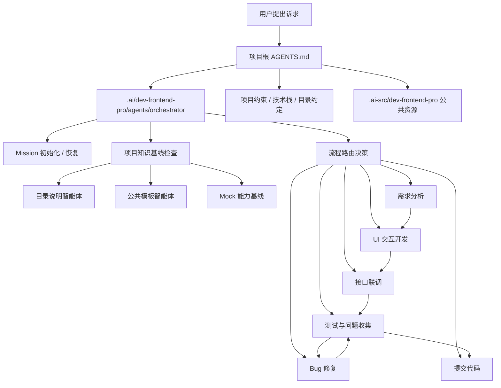
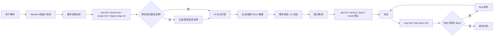
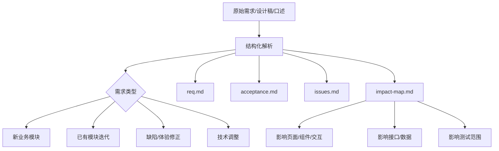
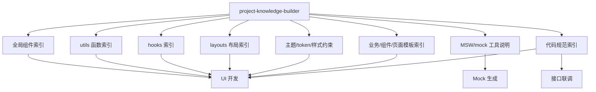
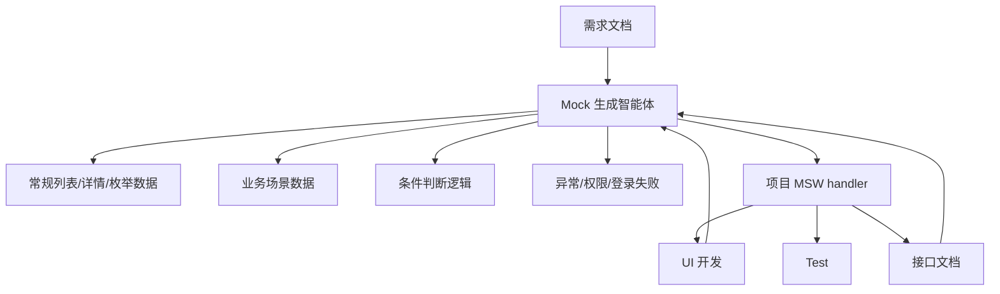
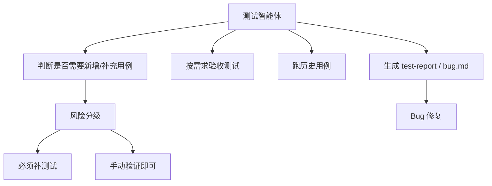

# dev-frontend-pro 架构计划

## 当前共识

- `dev-frontend-pro` 是 `packages/dev-frontend` 的第二套前端工作流智能体集合。
- 旧版满意度约 70%，新版重点解决架构关系、上下文质量、项目知识复用、Mock 质量、测试策略和流程可控性。
- 主入口不依赖 hook。项目根 `AGENTS.md` 负责告诉 AI 如何进入 `.ai` 中的智能体；hook 只作为可选增强，不作为流程正确性的前置条件。
- 智能体运行入口放在目标项目的 `.ai/` 下。
- AI 公共资源、模板、规则、索引源文件放在目标项目的 `.ai-src/` 下。

## 入口策略

推荐主路径：

1. 用户向 AI 提出诉求。
2. AI 读取项目根目录 `AGENTS.md`。
3. `AGENTS.md` 指向 `.ai/dev-frontend-pro/agents/orchestrator/AGENTS.md`。
4. Orchestrator 根据当前诉求、mission 状态、项目知识基线和可用资源，选择后续智能体。

不建议把 hook 作为主入口，原因：

- 不同 CLI 工具的 hook 机制、生命周期和安装方式不一致。
- hook 往往需要额外安装或授权，迁移成本高。
- hook 的触发时机不一定适合交互式需求分析。
- hook 更适合做自动校验、索引更新、提交前检查等增强能力。

hook 推荐定位：

- 可选触发项目知识索引更新。
- 可选做提交前自检。
- 可选检查 `.ai` / `.ai-src` 资源是否缺失。
- 不承担主流程启动职责。

## 目录分层

```text
.ai/
├── dev-frontend-pro/
│   ├── agents/
│   │   ├── orchestrator/
│   │   ├── requirement-analyst/
│   │   ├── project-knowledge-builder/
│   │   ├── template-builder/
│   │   ├── ui-developer/
│   │   ├── mock-builder/
│   │   ├── api-integrator/
│   │   ├── test-planner-runner/
│   │   ├── bug-fixer/
│   │   └── commit-agent/
│   ├── skills/
│   └── hooks/
└── missions/
    └── {missionId}/
        ├── config.json
        ├── reqDocs/
        ├── apiDocs/
        ├── testDocs/
        ├── bugDocs/
        └── reports/

.ai-src/
├── dev-frontend-pro/
│   ├── docs/
│   │   ├── rules/
│   │   ├── indexes/
│   │   ├── templates/
│   │   └── examples/
│   ├── templates/
│   │   ├── modules/
│   │   ├── components/
│   │   ├── pages/
│   │   ├── hooks/
│   │   ├── mocks/
│   │   └── tests/
│   ├── references/
│   └── scripts/
```

分层原则：

- `.ai`：放 AI 可直接调用的智能体、skills、hooks 和 mission 运行态产物。
- `.ai-src`：放公共资源、模板、规则、示例、知识索引源文件。
- mission 产物继续隔离在 `.ai/missions/{missionId}`，避免不同任务互相污染。
- 项目级长期知识沉淀放 `.ai-src/dev-frontend-pro/docs/indexes/`，不要重复写进每个 mission。

## 总入口关系图



## 标准需求迭代流程



完整链路：

1. 需求读取分析
2. UI 交互开发
3. 接口联调
4. 测试
5. Bug 修复
6. 提交代码

允许按需跳步，但每次跳步必须通过 orchestrator 的交接关卡判断。

## 智能体职责

| 智能体 | 位置 | 核心职责 |
|---|---|---|
| orchestrator | `.ai/dev-frontend-pro/agents/orchestrator` | 总调度、路由、阶段关卡、恢复任务 |
| requirement-analyst | `.ai/dev-frontend-pro/agents/requirement-analyst` | 需求结构化、澄清项、验收标准、影响面分析 |
| project-knowledge-builder | `.ai/dev-frontend-pro/agents/project-knowledge-builder` | 生成和更新目录说明、组件索引、utils、hooks、layouts、主题、mock 工具说明 |
| template-builder | `.ai/dev-frontend-pro/agents/template-builder` | 根据项目生成业务模块、组件、页面、hook、mock、test 模板 |
| ui-developer | `.ai/dev-frontend-pro/agents/ui-developer` | 基于需求、模板和项目知识开发 UI 与交互 |
| mock-builder | `.ai/dev-frontend-pro/agents/mock-builder` | 基于需求/API/MSW 工具生成 mock 数据和场景逻辑 |
| api-integrator | `.ai/dev-frontend-pro/agents/api-integrator` | 根据接口文档更新类型、service、hooks 和 mock |
| test-planner-runner | `.ai/dev-frontend-pro/agents/test-planner-runner` | 判断测试策略、补必要用例、执行需求验收和历史回归 |
| bug-fixer | `.ai/dev-frontend-pro/agents/bug-fixer` | 基于 bug 文档修复问题并回写状态 |
| commit-agent | `.ai/dev-frontend-pro/agents/commit-agent` | 提交前检查、变更摘要、commit |

## 需求分析增强

需求分析阶段需要比旧版更强，避免交互缺失、验收标准不完整和 AI 自行脑补。

建议产物：

- `reqDocs/req.md`：结构化需求。
- `reqDocs/issues.md`：待澄清问题。
- `reqDocs/scope.md`：本轮范围与非本轮范围。
- `reqDocs/impact-map.md`：需求影响面映射。

需求类型需要显式分类：



新业务模块与已有模块迭代需要区别处理：

| 类型 | 重点 |
|---|---|
| 新业务模块 | 模板选择、模块目录、路由/注册、基础 mock、完整测试基线 |
| 已有模块迭代 | 影响范围、兼容现有逻辑、回归范围、避免破坏历史行为 |
| 缺陷/体验修正 | 预期与实际差异、是否需要进入 bug 文档、是否属于需求变更 |
| 技术调整 | 不改变业务行为、明确回归范围、约束重构边界 |

`impact-map.md` 应把每条需求映射到：

- 页面区域
- 交互动作
- 数据字段
- 接口依赖
- 状态变化
- 权限/异常/空态/加载态
- 验收标准
- 测试范围

## 项目知识基线

`project-knowledge-builder` 负责生成 UI 开发依赖的项目知识，不建议让 `ui-developer` 临时扫描并自行判断。



建议索引产物放在：

```text
.ai-src/dev-frontend-pro/docs/indexes/
├── component-catalog.md
├── utils-catalog.md
├── hooks-catalog.md
├── layouts-catalog.md
├── theme-context.md
├── mock-tools.md
├── template-catalog.md
└── code-rules-index.md
```

组件/工具选择规则：

1. 先查项目知识基线。
2. 再查同类历史模块。
3. 全局组件满足场景时优先使用全局组件。
4. 全局组件不满足时使用项目 UI 库或已有封装。
5. 仍不满足时才新增本地组件，并在自检中说明新增原因。

## Mock 智能体

Mock 建议独立，不完全挂在 UI 开发内部。它同时服务 UI 开发、接口联调和测试。



Mock 分两类：

- UI 阶段 mock：保证页面和交互可运行，字段来自需求和合理占位。
- 联调阶段 mock：必须升级为接口契约镜像，字段名、响应包装、错误码、空值边界与真实接口文档一致。

MSW 场景需要支持：

- 常规成功返回。
- 空数据。
- 错误码。
- 登录失败或权限失败。
- 不同参数返回不同内容。
- 业务状态切换。
- mockjs 或项目自定义数据类型。

## UI 开发依赖

`ui-developer` 的输入不应只有需求文档，还应包括：

- `reqDocs/req.md`
- `reqDocs/impact-map.md`
- 业务模板参考
- 代码规范
- 组件索引
- utils 索引
- hooks 索引
- layouts 索引
- 主题/token 说明
- mock 工具说明
- UI 设计稿或交互说明

UI 开发完成后必须做自检：

- 每条需求是否有对应 UI 或交互实现。
- 每条验收标准是否可验证。
- 是否优先复用了项目组件。
- 是否误造了已有 utils/hooks/layouts。
- 是否保留模板占位符。
- 是否补充了必要 mock。
- 是否影响已有模块行为。

## 接口联调

接口联调依赖：

- 需求文档
- UI 实现
- 接口文档
- 业务模板参考
- 代码规范
- Mock 生成规则

输出：

- `apiDocs/api.md`
- `defs/type.ts` 或项目等效类型文件
- `defs/service.ts` 或项目等效 service 文件
- `hooks/useData.ts` 或项目等效数据层
- MSW mock 修正
- 接口联调说明

联调阶段重点：

- 真实接口契约优先，不沿用 UI 阶段的猜测 mock。
- 字段名、可空性、响应包装和错误码必须与接口文档一致。
- UI 字段适配放在数据层，不放在展示层。

## 测试策略

测试阶段拆成三个任务，但由同一个智能体管理：



不建议要求每个需求都强制写自动化测试。采用风险分级：

| 必须写或补测试 | 可以只做手动验证 |
|---|---|
| 核心业务计算/状态流 | 纯文案 |
| 表单校验/提交 | 简单样式调整 |
| 权限/登录/错误码 | 非关键视觉微调 |
| 数据转换/接口适配 | 临时运营配置 |
| 历史 bug 回归 | 无逻辑展示块 |
| 多步骤交互流程 | 只读展示且无分支 |

测试输出建议：

- `testDocs/test-plan.md`：本轮测试范围和策略。
- `testDocs/test-report.md`：执行结果。
- `bugDocs/bug.md`：可修复问题清单。

## Bug 修复

`bug-fixer` 只修复已经登记在 `bugDocs/bug.md` 的问题。

规则：

- 没有 `BUG-*` 不进入修复。
- 修复前先写根因分析。
- 修复后必须回写修复方案和回归结果。
- 发现新问题时回到测试/问题收集阶段，不在修复阶段顺手扩范围。

## 提交代码

`commit-agent` 负责最后收口：

- 检查需求、接口、测试、bug 文档状态。
- 检查工作区改动是否只包含本轮任务。
- 汇总变更说明。
- 运行必要验证。
- 生成 commit message。
- 在用户允许时提交代码。

## 待继续细化

后续需要逐步细化：

1. `.ai/dev-frontend-pro/agents/orchestrator/AGENTS.md`
2. 每个子智能体的 `AGENTS.md`
3. `.ai-src/dev-frontend-pro/docs/templates/` 下的文档模板
4. `.ai-src/dev-frontend-pro/docs/rules/` 下的规则
5. `.ai-src/dev-frontend-pro/templates/` 下的业务模板、组件模板、页面模板、mock 模板、测试模板
6. mission `config.json` 的新版字段
7. 各阶段 handoff gate 的通过条件
8. hook 的可选增强点
